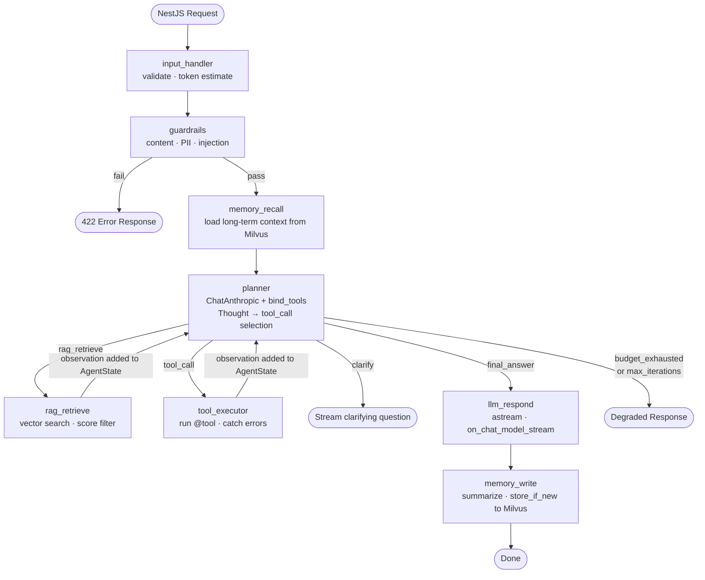

# app-ai — Python AI Agent Service Architecture

> **Scope:** This document is an overview of the AI Agent Runtime layer inside `app-ai` (FastAPI/Python).
> For the full system architecture (Next.js → NestJS → FastAPI → Claude), see [app-architecture.md](app-architecture.md).
>
> **Focused implementation guides (start here):**
> - [app-ai-with-langchain.md](app-ai-with-langchain.md) — **Phase 1:** Build the agent with LangChain only (manual loop, one file). Start here.
> - [app-ai-with-langgraph.md](app-ai-with-langgraph.md) — **Phase 2:** Upgrade to LangGraph `StateGraph` (graph nodes, crash recovery). Do this after Phase 1.
>
> This document covers both phases together as a reference. For a step-by-step build guide, use the focused documents above.

---

## 1. Where app-ai Fits

```text
Client (Next.js / React)
        │  HTTPS / WebSocket
        ▼
API Gateway (Nginx / Cloudflare)
        │  HTTP internal
        ▼
app-service (NestJS — BFF)
        │  HTTP internal
        │  sends: { message, history, userId, userContext }
        ▼
app-ai (FastAPI — Python)         ← this document
        │
        ▼
AI Agent Runtime (LangChain / LangGraph stack)
        │
        ├── ChatAnthropic via langchain-anthropic  (LLM reasoning + tool calling)
        ├── LangGraph StateGraph                   (agent loop as a directed graph)
        ├── Milvus via pymilvus                    (vector search — RAG + memory)
        └── LangChain tools                        (web search, code exec, calculator, SQL)
```

`app-ai` is **stateless**. It receives full context on every request from `app-service` and never stores user state — that responsibility belongs to NestJS and PostgreSQL.

### Build Phases — LangChain First, Then LangGraph

This project is built in two phases. Phase 1 is a complete, working agent. Phase 2 upgrades the loop internals without changing the API surface.

|                      | Phase 1 — LangChain only                      | Phase 2 — Add LangGraph                                                     |
| -------------------- | --------------------------------------------- | --------------------------------------------------------------------------- |
| **Agent loop**       | Manual `for` loop in `agent_loop.py`          | `StateGraph` compiled graph in `graph.py`                                   |
| **State tracking**   | Plain `dict` / local variables                | `AgentState` TypedDict managed by LangGraph                                 |
| **Routing**          | `if/elif` inside the loop body                | `route_after_planner()` + conditional edges                                 |
| **Streaming**        | `llm.astream()` directly in router            | `agent_graph.astream_events()` in router                                    |
| **Crash recovery**   | None — state lost if server restarts mid-loop | `MemorySaver` checkpoints after every node                                  |
| **New files needed** | `agent_loop.py` (one file)                    | `state.py` + `nodes.py` + `graph.py` (three files, replace `agent_loop.py`) |

**LangChain components used in both phases — learn these first:**

```text
ChatAnthropic          the LLM client (langchain-anthropic)
bind_tools(TOOLS)      attach tool schemas so Claude returns structured tool_calls
@tool decorator        wrap a plain function as a LangChain tool
HumanMessage           typed user message (replaces {"role": "user", "content": ...})
AIMessage              typed assistant message
SystemMessage          typed system prompt
ToolMessage            typed tool result fed back to the LLM
llm.astream()          stream tokens one-by-one from the LLM
VectorMemory           long-term user memory in Milvus (same in both phases)
EmbeddingClient        RAG embeddings (same in both phases)
```

**LangGraph components added in Phase 2:**

```text
StateGraph             the compiled agent graph (replaces the for loop)
AgentState TypedDict   state schema; LangGraph passes it between nodes automatically
MemorySaver            checkpoints state after every node (crash recovery)
astream_events()       event stream; filter on_chat_model_stream to forward tokens as SSE
```

---

## 2. Context Payload from NestJS

Every request arriving at `app-ai` carries a normalized payload assembled by `app-service`:

```json
{
  "user_id": "usr_abc123",
  "message": "What are the benefits of RAG?",
  "history": [
    { "role": "user", "content": "Hello" },
    { "role": "assistant", "content": "Hi! How can I help?" }
  ],
  "user_context": {
    "subscription_tier": "pro",
    "locale": "en-US",
    "timezone": "America/New_York"
  },
  "session_id": "sess_xyz789"
}
```

The Input Handler (Component 1) normalizes this payload before anything else runs. The agent never reads raw HTTP headers or JWT tokens — that boundary is enforced at the NestJS layer.

---

## 3. Core AI Agent Architecture

The agent follows the **ReAct pattern** (Reason → Act → Observe → repeat). The same pipeline runs in both phases — the difference is only how the loop is implemented internally.

### Phase 1 — LangChain (manual loop)

A plain Python `for` loop drives the agent. Every step is explicit code you can read line by line.

```text
NestJS Request
      │
      ▼
input_handler()   ← parse + validate payload
      │
      ▼
guardrails()      ← content policy · PII · injection check
      │ fail ──► 422 Error
      ▼
memory_recall()   ← load long-term context from Milvus
      │
      ▼
┌─────────────────────────────────────────────────┐
│  for i in range(MAX_ITERATIONS):                │
│                                                 │
│  planner: llm.bind_tools(TOOLS).ainvoke(msgs)  │
│                                                 │
│  if no tool_calls ──► break  (final answer)    │
│                                                 │
│  elif tool == "rag_retrieve" → retriever.query │
│  else                        → tool.ainvoke    │
│                                                 │
│  append ToolMessage → messages (loop continues)│
└─────────────────────────────────────────────────┘
      │
      ▼
llm.astream(messages) → yield tokens (SSE)
      │
      ▼
memory_write()   ← summarize + store to Milvus
```

### Phase 2 — LangGraph (StateGraph)

The same steps become **graph nodes**. LangGraph manages state passing and routing automatically — no `if/elif` inside the loop, no manual message appending.

```text
                    NestJS Request
                         │
                         ▼
                ┌─────────────────┐
                │  input_handler  │  parse · validate · estimate tokens
                └────────┬────────┘
                         │
                         ▼
                ┌─────────────────┐
                │    guardrails   │  content policy · PII redact · injection detect
                └────────┬────────┘
                    pass │  fail ──────────────────────────► 422 Error
                         ▼
                ┌─────────────────┐
                │  memory_recall  │  load user long-term context from Milvus
                └────────┬────────┘
                         │
                         ▼
                ┌─────────────────────────────────────────┐
                │   planner  (ChatAnthropic + bind_tools) │
                │   Thought → Action decision             │
                └──┬──────────┬──────────┬───────────────┘
                   │          │          │
            rag_retrieve  tool_call  final_answer
                   │          │          │
                   ▼          ▼          ▼
            ┌──────────┐ ┌─────────┐ ┌──────────────┐
            │rag_retrie│ │tool_exec│ │  llm_respond │
            │ve        │ │utor     │ │  (astream)   │
            └────┬─────┘ └────┬────┘ └──────┬───────┘
                 │            │              │
                 └────────────┘              ▼
                      │               ┌──────────────┐
               observation            │ memory_write │  summarize · store to Milvus
                      │               └──────┬───────┘
                      └──► planner           │
                           (next iter)       ▼
                                            END
```

**What changed between phases:** `planner` and each action become separate Python functions (nodes). `route_after_planner()` replaces the `if/elif` block. `AgentState` replaces local variables inside the loop. The API and external behaviour are identical.

---

## 4. The Seven Core Components

---

### Component 1 — Input Handler

Prepares and validates the incoming request before any agent logic runs.

**Responsibilities:**

```text
Receive NestJS payload
Parse and validate with Pydantic
Attach conversation history
Identify user context (tier, locale)
Normalize message encoding
Estimate incoming token count
Reject malformed requests early (400)
```

**Pydantic model:**

```python
# app/schemas/request.py
#
# Pydantic is a data-validation library. When the NestJS request arrives as JSON,
# Pydantic automatically parses it into these Python objects AND enforces all the
# constraints (min_length, required fields, allowed values). If validation fails,
# FastAPI returns a 422 error automatically — no manual if-checks needed.

from pydantic import BaseModel, Field   # BaseModel = base class for all validated data objects
from typing import Literal              # Literal restricts a field to a fixed set of string values

# HistoryMessage represents one turn in the conversation.
# Inheriting from BaseModel means Pydantic handles all parsing and validation.
class HistoryMessage(BaseModel):
    role: Literal["user", "assistant"]  # only these two strings are allowed — anything else raises a 422
    content: str                        # the text of that message turn

# UserContext carries metadata about who the user is (not what they asked).
class UserContext(BaseModel):
    subscription_tier: str              # e.g. "free", "pro" — used to gate features
    locale: str = "en-US"              # default value: if NestJS omits this, Python uses "en-US"
    timezone: str = "UTC"              # default value: safe fallback for datetime display

# AgentRequest is the top-level object FastAPI parses from every incoming POST body.
# All fields without defaults are REQUIRED — FastAPI rejects requests missing them.
class AgentRequest(BaseModel):
    user_id: str
    message: str = Field(..., min_length=1, max_length=10_000)
    #               ^^^  Field(...) means "required".
    #               min_length=1 → empty strings rejected
    #               max_length=10_000 → protects against huge payloads
    history: list[HistoryMessage] = []  # list of prior turns; defaults to empty for first message
    user_context: UserContext           # nested object — Pydantic validates it recursively
    session_id: str
```

---

### Component 2 — Guardrails

A safety layer that runs **before the Planner** receives any input. It cannot be bypassed.

**Three checks, in order:**

```text
1. Content policy
   └── Reject harmful, illegal, or policy-violating requests
       Return 422 with reason code

2. PII detection
   └── Detect and redact: email, phone, SSN, credit card patterns
       Log redaction event for compliance audit

3. Prompt injection detection
   └── Detect instruction-override patterns in user message
       e.g. "Ignore previous instructions and..."
       Sanitize or reject
```

**Implementation pattern:**

```python
# app/guardrails/checker.py
#
# GuardrailChecker is the safety gate. It runs BEFORE the Planner and LLM so
# harmful or malformed input never reaches expensive AI calls.
# The class is intentionally simple — three sequential checks, early exit on failure.

class GuardrailChecker:
    # `message: str` is a type hint — Python won't enforce it at runtime,
    # but IDEs and linters use it to catch mistakes. `-> GuardrailResult`
    # declares what this method returns.
    def check(self, message: str) -> GuardrailResult:
        # Start with a passing result containing the original message.
        # Each check may flip `passed=False` or update `sanitized_message`.
        result = GuardrailResult(passed=True, sanitized_message=message)

        # CHECK 1: content policy (e.g. violence, illegal instructions)
        # If this fails, we return immediately — no need to run the other checks.
        result = self._check_content_policy(result)
        if not result.passed:
            return result           # early return = fast rejection, saves CPU

        # CHECK 2: PII detection and redaction (email, phone, SSN, credit card)
        # This does NOT fail the request — it scrubs the sensitive data in-place.
        result = self._redact_pii(result)

        # CHECK 3: prompt injection (e.g. "Ignore previous instructions and...")
        # Mutates `sanitized_message` or flips `passed` if injection detected.
        result = self._check_injection(result)

        return result   # caller reads result.passed and result.sanitized_message
```

Guardrails run synchronously and must complete in under 100ms. They never call the LLM.

---

### Component 3 — Planner

The Planner is the `planner_node` function in the LangGraph graph. It runs on every iteration and decides what to do next using **ChatAnthropic with `bind_tools()`** — Claude selects an action by calling one of the registered tool schemas, so no manual JSON parsing is needed.

**ReAct pattern (Thought → Action → Observation):**

```text
User question:
"What are the benefits of RAG?"

Iteration 1:
  planner_node calls llm.bind_tools(TOOLS).ainvoke(messages)
  Claude responds with tool_call → rag_retrieve("benefits of RAG systems")
  → graph routes to rag_retrieve_node
  → observation stored in AgentState["iterations"]

Iteration 2:
  planner_node sees prior observation in AgentState
  Claude responds with tool_call → final_answer
  → graph routes to llm_respond_node → streams reply
```

**How tool-based routing replaces the old ActionType Enum:**

```python
# app/agent/nodes.py  (planner_node)
#
# Instead of parsing Claude's raw text output and matching it against an Enum,
# we use LangChain's bind_tools() which makes Claude return a STRUCTURED tool_call.
# The tool name is the action type — no if/elif chain, no regex, no JSON parsing.

async def planner_node(state: AgentState) -> dict:
    system_prompt = build_system_prompt(state)
    messages = build_messages(system_prompt, state["history"])

    # bind_tools() tells Claude which tools exist AND formats them as OpenAI-compatible
    # tool schemas that the Anthropic API understands.
    # Claude picks one tool per response — that IS the action decision.
    planner_llm = llm.bind_tools(TOOLS)   # TOOLS = list of LangChain tool objects

    response = await planner_llm.ainvoke(messages)
    # response.tool_calls is a structured list, e.g.:
    #   [{"name": "rag_retrieve", "args": {"query": "benefits of RAG"}, "id": "..."}]
    # No text parsing needed — the name IS the routing key.

    action = response.tool_calls[0] if response.tool_calls else {"name": "final_answer", "args": {}}
    return {"current_action": action}
```

**The four routing outcomes** (handled in `route_after_planner` in `graph.py`):

```text
rag_retrieve  → rag_retrieve_node  (vector search in Milvus)
tool_call     → tool_executor_node (run a LangChain tool)
final_answer  → llm_respond_node   (stream the response)
clarify       → END                (ask user a follow-up question)
```

The planner receives the full `AgentState` on every iteration — prior observations, retrieved documents, and tool results are already in state, so the LLM naturally avoids repeating work.

---

### Component 4 — Tool Registry and Executor

Tools extend what the agent can do beyond LLM reasoning. In the LangChain stack, tools are defined with the **`@tool` decorator** from `langchain_core.tools`. This makes them automatically compatible with `llm.bind_tools()` — the planner can attach them to any LLM call without extra conversion.

**Defining tools with `@tool`:**

```python
# app/tools/web_search.py
#
# The @tool decorator does three things:
#   1. Wraps the function as a LangChain-compatible tool object
#   2. Uses the docstring as the tool description injected into the LLM prompt
#      (Claude reads this to decide when to call the tool)
#   3. Generates a JSON schema from the type hints (str, int, etc.) so bind_tools()
#      can tell the Anthropic API exactly what arguments this tool accepts

from langchain_core.tools import tool   # pip install langchain-core

@tool
def web_search(query: str) -> str:
    """Search the web for current information. Use when the question needs recent
    data, news, or facts that may not be in the knowledge base."""
    # function body calls Tavily / SerpAPI here
    ...

@tool
def calculator(expression: str) -> str:
    """Evaluate a mathematical expression safely. Use for arithmetic, percentages,
    unit conversions. Input must be a valid math expression like '15 * 1.08'."""
    ...

@tool
def code_exec(code: str) -> str:
    """Execute Python code in a sandboxed subprocess and return stdout.
    Use for data analysis, formatting, or computation that needs real code."""
    ...

@tool
def database_query(sql: str) -> str:
    """Run a READ-ONLY SQL query against the internal database.
    Never accepts INSERT, UPDATE, DELETE, or DROP statements."""
    ...
```

**Tool registry — a plain list, not a dict:**

```python
# app/tools/registry.py
#
# With LangChain tools, the registry is a LIST, not a dict.
# Reason: llm.bind_tools(TOOLS) expects a list of LangChain tool objects.
# LangChain reads each tool's .name and .description automatically —
# you do not need to manage a name→tool mapping yourself.

from app.tools.web_search import web_search
from app.tools.calculator  import calculator
from app.tools.code_exec   import code_exec
from app.tools.database    import database_query

# This list is passed directly to llm.bind_tools() in the planner node.
# To add a new tool: define it with @tool above, import it, add it here.
TOOLS: list = [web_search, calculator, code_exec, database_query]

# For tool_executor_node, build a name→tool lookup from the same list:
# tool_map: dict = {t.name: t for t in TOOLS}
# This avoids duplicating names — the @tool decorator sets .name from the function name.
```

**Executing tools in `tool_executor_node`:**

```python
# app/agent/nodes.py  (tool_executor_node)
#
# With LangChain tools, execution is simpler than the old ToolExecutor class.
# Each @tool function is already a callable — just invoke it with the args dict.
# Error handling: wrap in try/except and return the error string as the observation
# so the LLM sees it and can choose a different tool or degrade gracefully.

from app.tools.registry import TOOLS

tool_map = {t.name: t for t in TOOLS}   # build lookup once at import time

async def tool_executor_node(state: AgentState) -> dict:
    action = state["current_action"]
    tool_name = action["name"]       # e.g. "web_search"
    tool_args = action["args"]       # e.g. {"query": "Tesla revenue 2024"}

    tool = tool_map.get(tool_name)
    if tool is None:
        observation = f"Error: unknown tool '{tool_name}'"
    else:
        try:
            # `.invoke(args)` runs the @tool function synchronously (LangChain default).
            # For async tools use `.ainvoke(args)` instead.
            observation = tool.invoke(tool_args)
        except Exception as e:
            # Tool errors become observations — the LLM sees the message and adapts.
            # The graph never crashes due to a tool failure.
            observation = f"Error: {tool_name} failed — {str(e)}"

    new_iteration = {
        "thought":     action.get("thought", ""),
        "action":      f"tool_call({tool_name})",
        "observation": str(observation),
    }
    return {
        "tool_results": {**state["tool_results"], tool_name: observation},
        "iterations":   state["iterations"] + [new_iteration],
        "tokens_used":  state["tokens_used"] + len(str(observation)) // 4,
    }
```

Tool failures become observations returned to the LLM — the planner decides whether to try a different tool, ask for clarification, or proceed to a final answer. The graph never raises an unhandled exception from a tool.

---

### Component 5 — Memory System

> For the full guide (what memory is, why it matters, how each scope works, failure handling, and design rules), see [agent-memory.md](agent-memory.md).

The agent uses two memory scopes that serve different purposes and have different lifetimes.

#### Short-term memory — `app/agent/state.py` (`AgentState`)

Scope: **one request**. Managed automatically by LangGraph. Destroyed when the graph run ends.

In the LangGraph stack, `ShortMemory` is replaced by the `AgentState` TypedDict. LangGraph holds the state object in memory and passes it into every node function — no manual passing of objects between functions is needed. The reasoning chain accumulates in `AgentState["iterations"]` just as it did in `ShortMemory.iterations`.

```python
# AgentState replaces ShortMemory — LangGraph manages this automatically.
# Each node reads from state and returns only the fields it updates.
class AgentState(TypedDict):
    iterations:    list[dict]   # Thought/Action/Observation chain (was ShortMemory.iterations)
    tool_results:  dict         # keyed by tool name — deduplicates calls (was ShortMemory.tool_results)
    rag_documents: list[str]    # retrieved docs this request (was ShortMemory.rag_documents)
    tokens_used:   int          # running token count (was ShortMemory.token_budget.used)
    # ... plus input fields, long-term memory, current_action, final_response, error
```

#### Long-term memory — `app/memory/vector_memory.py`

Scope: **across sessions**. Stored in Milvus (`user_memory` collection, per-user filtered). Persists indefinitely until explicitly deleted.

Holds user preferences, past task summaries, and domain context specific to this user. Recalled **once per request before the Planner runs** and injected into the LLM system prompt. Written **after the response is sent**, never during the loop.

```python
class VectorMemory:
    COLLECTION = "user_memory"
    MIN_SCORE  = 0.78    # higher threshold than RAG — recall must be confident

    async def recall(self, user_id: str, query: str, top_k: int = 5) -> list[MemoryChunk]: ...
    async def store(self, user_id: str, content: str, tags: list[str]) -> None: ...
    async def forget(self, user_id: str, memory_id: str) -> None: ...  # GDPR deletion
```

#### Memory position in the LLM prompt

```text
1. System Prompt
2. Long-term Memory     ← recalled before loop; shapes all reasoning that follows
3. Conversation History
4. RAG Documents        ← facts for this question
5. Short-term Memory    ← prior iterations this loop (most recent = closest to attention)
6. Tool Results
7. User Message
```

#### Key rules

- Long-term memory is **optional enrichment** — the agent loop must complete correctly even when Milvus is unavailable.
- `user_memory` and `knowledge_base` are **separate Milvus collections** — memory is per-user and GDPR-scoped; RAG is shared.
- The LLM never writes to memory directly — only the post-response handler does.

---

### Component 6 — RAG Retriever

> For the full guide (what RAG is, embedding models, chunking strategy, ingestion pipeline, score tuning, hybrid search, re-ranking, and production checklist), see [agent-rag.md](agent-rag.md).

Retrieves external knowledge from the vector store when the question requires it.

**Pipeline:**

```text
User question
      │
      ▼
Embedding model (Claude / OpenAI)
      │
      ▼
Milvus similarity search
      │
      ▼
Top-K document chunks retrieved
      │
      ▼
Re-rank by relevance score
      │
      ▼
Inject into LLM prompt context
```

**Implementation:**

```python
# app/rag/retriever.py
class RAGRetriever:
    TOP_K = 5
    MIN_SCORE = 0.72   # discard low-relevance results

    async def retrieve(self, query: str) -> list[Document]:
        embedding = await self.embedder.embed(query)

        results = await self.milvus_client.search(
            collection_name="knowledge_base",
            data=[embedding],
            limit=self.TOP_K,
            output_fields=["content", "source", "updated_at"],
        )

        return [
            Document(content=r["content"], source=r["source"], score=r["distance"])
            for r in results
            if r["distance"] >= self.MIN_SCORE
        ]
```

**Embedding model:**

```python
# app/rag/embeddings.py
class EmbeddingClient:
    # Claude does not provide embeddings — use a dedicated model
    MODEL = "text-embedding-3-small"    # OpenAI
    # or: "embed-english-v3.0"         # Cohere

    async def embed(self, text: str) -> list[float]:
        response = await self.client.embeddings.create(
            model=self.MODEL,
            input=text
        )
        return response.data[0].embedding
```

---

### Component 7 — LLM Reasoning Engine

Claude is the core reasoning engine, accessed through **`ChatAnthropic`** from `langchain-anthropic`. Using the LangChain wrapper (not the raw Anthropic SDK) is required so that LangGraph can intercept every LLM call and emit the streaming events that the FastAPI SSE endpoint forwards to the browser.

**Prompt structure (order matters):**

```text
1. System Prompt
   └── Agent identity, tool descriptions, response format instructions,
       guardrail reminders, output language rules

2. Long-term Memory (recalled user preferences and past context)

3. Conversation History (from NestJS payload)

4. Retrieved RAG Documents (if RAG was triggered this iteration)

5. AgentState iterations (prior Thought/Action/Observation chain this loop)

6. User Message
```

**LLM client — `ChatAnthropic` (the only version for this stack):**

```python
# app/llm/claude_client.py
#
# ChatAnthropic is LangChain's wrapper around the Anthropic API.
# It speaks LangChain's Runnable interface, which means LangGraph can intercept
# every call and emit the correct streaming events automatically.
#
# Why NOT use the raw `anthropic.AsyncAnthropic()` client here:
#   - The raw SDK's `.stream()` yields tokens directly but is invisible to LangGraph.
#   - LangGraph's astream_events() fires on_chat_model_stream events ONLY when
#     a LangChain Runnable (like ChatAnthropic) runs — raw SDK calls are skipped.
#   - Result: the browser never receives tokens if you use the raw SDK with LangGraph.

from langchain_anthropic import ChatAnthropic          # pip install langchain-anthropic
from langchain_core.messages import (
    SystemMessage,   # the system prompt — agent identity, rules, tool list
    HumanMessage,    # a user turn in the conversation
    AIMessage,       # an assistant turn (also carries .tool_calls when Claude picks an action)
    BaseMessage,     # base type for all message objects (useful for type hints)
)
from app.config.settings import settings

# Module-level singleton — import `llm` directly in node functions.
# `streaming=True` is REQUIRED: without it, astream_events emits no token events.
llm = ChatAnthropic(
    model=settings.claude_model,                 # "claude-sonnet-4-6"
    max_tokens=settings.claude_max_tokens,        # 4096
    anthropic_api_key=settings.anthropic_api_key,
    streaming=True,   # enables on_chat_model_stream events in LangGraph's astream_events()
)

# Helper: convert AgentState history (list of dicts) into LangChain message objects.
# LangGraph nodes call this to build the messages list for every LLM call.
# The Anthropic API accepts plain dicts, but ChatAnthropic requires typed objects.
def build_messages(system_prompt: str, history: list[dict]) -> list[BaseMessage]:
    messages: list[BaseMessage] = [SystemMessage(content=system_prompt)]
    for turn in history:
        if turn["role"] == "user":
            messages.append(HumanMessage(content=turn["content"]))
        else:
            messages.append(AIMessage(content=turn["content"]))
    return messages
```

**Two call patterns used by different nodes:**

```python
# ── Pattern 1: planner_node (structured tool selection) ──────────────────────
# bind_tools() attaches tool schemas to this specific call only.
# Claude responds with a structured tool_call block — no text parsing needed.
response = await llm.bind_tools(TOOLS).ainvoke(messages)
action = response.tool_calls[0]   # {"name": "rag_retrieve", "args": {...}}

# ── Pattern 2: llm_respond_node (streaming final answer) ─────────────────────
# astream() yields AIMessageChunk objects one token at a time.
# LangGraph captures each chunk and fires on_chat_model_stream automatically —
# the FastAPI router filters these events and forwards them to the browser via SSE.
async for chunk in llm.astream(messages):
    full_response += chunk.content
```

---

## 5. Token Budget Management

Agents that iterate multiple steps can silently overflow the Claude context window. The token budget is tracked per request and enforced before every LLM call.

```python
# app/agent/token_budget.py
#
# Claude has a 200,000 token context window. If the accumulated context
# (history + RAG docs + tool results + iterations) exceeds it, the API call
# fails. This class tracks token consumption across the loop and trims history
# proactively — before each LLM call, not after it fails.

@dataclass   # @dataclass auto-generates __init__, __repr__, __eq__ for this class
class TokenBudget:
    MODEL_CONTEXT_LIMIT = 200_000    # claude-sonnet-4-6 maximum context (underscores are valid in numbers for readability)
    RESPONSE_RESERVE    = 4_096      # tokens reserved for Claude's output — never consumed by input
    SAFETY_MARGIN       = 2_000      # extra buffer to absorb estimation errors

    # The actual number of tokens we can safely fill with input content:
    USABLE_LIMIT = MODEL_CONTEXT_LIMIT - RESPONSE_RESERVE - SAFETY_MARGIN   # = 193,904

    used: int = 0   # running total consumed so far this request (starts at 0)

    def consume(self, tokens: int) -> None:
        self.used += tokens   # accumulate each time we add content to the prompt

    @property   # @property lets you call `budget.remaining` like an attribute, not `budget.remaining()`
    def remaining(self) -> int:
        return self.USABLE_LIMIT - self.used

    @property
    def is_exhausted(self) -> bool:
        return self.remaining <= 0

    def trim_history(self, history: list[dict]) -> list[dict]:
        """Drop oldest messages until the history fits the remaining budget."""
        # We drop messages in pairs (user + assistant) so the conversation
        # always starts with a user turn — some LLM APIs require this.
        while history and self._estimate(history) > self.remaining:
            history = history[2:]    # slice off the first two items (oldest user + assistant pair)
        return history

    @staticmethod   # @staticmethod = belongs to the class but doesn't need `self` — it's a pure function
    def _estimate(messages: list[dict]) -> int:
        # Rough token estimate: 1 token ≈ 4 characters (true for English; varies by language)
        # `sum(...)` with a generator expression — equivalent to a for-loop that adds up values
        return sum(len(m["content"]) // 4 for m in messages)
        #                              ^^^ integer division: 20 chars → 5 tokens
```

**Budget is checked at three points:**

1. After Input Handler — estimate total incoming tokens
2. Before each LLM call — trim history if needed
3. Before adding RAG documents — skip retrieval if no budget remains

---

## 6. The Agent Loop

### Phase 1 — LangChain (manual loop in `agent_loop.py`)

The loop is a plain `async def run()` function. The planner calls `llm.bind_tools(TOOLS).ainvoke()` each iteration. If Claude returns a tool call, execute it and append a `ToolMessage`. If Claude returns no tool call, stream the final answer and break.

```python
# app/agent/agent_loop.py  (Phase 1 — LangChain only, no LangGraph)
#
# run() is an async generator: it yields SSE tokens one by one.
# The FastAPI router wraps it in a StreamingResponse.

from langchain_anthropic import ChatAnthropic
from langchain_core.messages import HumanMessage, ToolMessage
from app.llm.claude_client import llm, build_messages     # ChatAnthropic singleton
from app.tools.registry import TOOLS, tool_map            # @tool list + lookup dict
from app.memory.vector_memory import VectorMemory
from app.rag.retriever import Retriever

MAX_ITERATIONS = 10

async def run(request: AgentRequest):
    # ── Step 1: recall long-term memory ──────────────────────────────────────
    memory  = VectorMemory()
    recalled = await memory.recall(request.user_id, request.message, top_k=5)

    # ── Step 2: build initial message list ───────────────────────────────────
    # build_messages() converts history dicts → typed LangChain message objects
    system_prompt = build_system_prompt(recalled)
    messages      = build_messages(system_prompt, request.history)
    messages.append(HumanMessage(content=request.message))

    # bind_tools() once — attaches JSON schemas for all tools to every ainvoke call
    planner    = llm.bind_tools(TOOLS)
    iterations = []     # track what happened each loop iteration
    tokens_used = 0

    # ── Step 3: ReAct loop ───────────────────────────────────────────────────
    for i in range(MAX_ITERATIONS):
        response     = await planner.ainvoke(messages)
        tokens_used += response.usage_metadata.get("total_tokens", 0)

        if not response.tool_calls:
            # Claude returned no tool call → this is the final answer.
            # Stream it token-by-token directly from the LLM.
            async for chunk in llm.astream(messages):
                yield chunk.content    # caller forwards each token as an SSE frame
            break

        # Claude chose a tool — execute it and feed the result back
        tool_call = response.tool_calls[0]
        tool_name = tool_call["name"]
        tool_args = tool_call["args"]

        if tool_name == "rag_retrieve":
            result = await Retriever().query(tool_args["query"])
        else:
            tool   = tool_map.get(tool_name)
            result = await tool.ainvoke(tool_args)

        iterations.append({"tool": tool_name, "args": tool_args, "result": str(result)})

        # Append both the assistant turn (with tool_call) and the tool result
        # so the planner sees the observation on the next iteration
        messages.append(response)
        messages.append(ToolMessage(content=str(result), tool_call_id=tool_call["id"]))

    # ── Step 4: write to long-term memory ────────────────────────────────────
    await memory.store_if_new(request.user_id, summarize(iterations), tags=["session"])
```

**What Phase 1 gives you:**

- Full ReAct loop with tool calling — `bind_tools()` + `ToolMessage` feedback
- RAG retrieval as a branch inside the loop
- Long-term memory recall and write
- SSE token streaming via `llm.astream()`

**What Phase 1 does not have:**

- State checkpointing (server restart mid-loop loses the iteration chain)
- Graph visualization
- Easy parallel node execution

---

### Phase 2 — LangGraph (compiled `StateGraph` in `graph.py`)

Each function above becomes a **named node**. LangGraph passes `AgentState` between them and handles the loop via edges — no `for` loop, no `if/elif` routing inside the function.

```python
# app/agent/graph.py  (Phase 2 — LangGraph)
#
# build_agent_graph() wires all node functions together into a runnable graph.
# Reading this file gives you a complete map of the agent's control flow —
# no need to trace through if/elif chains inside a loop.

from langgraph.graph import StateGraph, END
# StateGraph = the graph builder class
# END = a special LangGraph constant meaning "stop the graph here"

from langgraph.checkpoint.memory import MemorySaver
# MemorySaver saves AgentState after every node. If the server restarts mid-loop,
# the graph can resume from the last checkpoint rather than starting over.

from app.agent.state import AgentState
from app.agent.nodes import (
    input_handler, guardrails_node, memory_recall_node, planner_node,
    rag_retrieve_node, tool_executor_node, llm_respond_node, memory_write_node,
)

MAX_ITERATIONS = 10   # hard cap — prevents runaway loops and infinite API costs

# ── Router function ─────────────────────────────────────────────────────────
# Called after every planner_node run. Returns the NAME of the next node.
# This replaces the `if/elif action.type` block that would live inside a manual loop.
def route_after_planner(state: AgentState) -> str:
    if state.get("error"):
        return END   # guardrails failed — terminate immediately

    if state["tokens_used"] >= 193_904 or len(state["iterations"]) >= MAX_ITERATIONS:
        return END   # budget exhausted or iteration cap reached — degrade gracefully

    # Route based on the tool_call name the planner returned
    # (set in AgentState["current_action"]["name"] by planner_node)
    action_name = state["current_action"].get("name", "final_answer")
    return {
        "rag_retrieve":  "rag_retrieve",   # key = action name → value = node to run next
        "tool_call":     "tool_executor",
        "final_answer":  "llm_respond",
        "clarify":       END,
    }.get(action_name, END)               # unknown action → safe termination

# ── Graph construction ──────────────────────────────────────────────────────
def build_agent_graph() -> StateGraph:
    graph = StateGraph(AgentState)   # AgentState TypedDict tells LangGraph the state shape

    # Register nodes — string name maps to the async function
    graph.add_node("input_handler",  input_handler)
    graph.add_node("guardrails",     guardrails_node)
    graph.add_node("memory_recall",  memory_recall_node)
    graph.add_node("planner",        planner_node)
    graph.add_node("rag_retrieve",   rag_retrieve_node)
    graph.add_node("tool_executor",  tool_executor_node)
    graph.add_node("llm_respond",    llm_respond_node)
    graph.add_node("memory_write",   memory_write_node)

    # Fixed edges — always taken in this order at the start of every request
    graph.set_entry_point("input_handler")
    graph.add_edge("input_handler", "guardrails")
    graph.add_edge("guardrails",    "memory_recall")
    graph.add_edge("memory_recall", "planner")

    # Conditional edges — after planner, route_after_planner() decides which node runs next
    graph.add_conditional_edges(
        "planner",             # source node
        route_after_planner,   # function that returns the next node name as a string
        {
            "rag_retrieve":  "rag_retrieve",
            "tool_executor": "tool_executor",
            "llm_respond":   "llm_respond",
            END:             END,
        }
    )

    # Loop edges — after each action, return to planner for the next iteration
    graph.add_edge("rag_retrieve",  "planner")
    graph.add_edge("tool_executor", "planner")

    # Terminal path — after the final answer is streamed, write memory then stop
    graph.add_edge("llm_respond",  "memory_write")
    graph.add_edge("memory_write", END)

    return graph.compile(checkpointer=MemorySaver())

# Module-level compiled graph — import and call agent_graph.astream_events() in the router
agent_graph = build_agent_graph()
```

**Phase 1 → Phase 2 migration map:**

| Phase 1 (manual loop)                    | Phase 2 (LangGraph graph)                                                                |
| ---------------------------------------- | ---------------------------------------------------------------------------------------- |
| `for i in range(MAX_ITERATIONS)`         | `route_after_planner` checks `len(state["iterations"]) >= MAX_ITERATIONS`                |
| `if not response.tool_calls: break`      | `add_conditional_edges` + `route_after_planner` returns `"llm_respond"`                  |
| Local `messages` list, appended manually | `AgentState["history"]` with `add_messages` reducer                                      |
| Local `iterations` list                  | `AgentState["iterations"]` updated by each node                                          |
| `tokens_used += n` inside the loop       | Node returns `{"tokens_used": state["tokens_used"] + n}`                                 |
| `llm.astream()` called in `run()`        | `llm.astream()` called inside `llm_respond_node`; tokens surfaced via `astream_events()` |

```py
#
# build_agent_graph() wires all node functions together into a runnable graph.
# Reading this file gives you a complete map of the agent's control flow —
# no need to trace through if/elif chains inside a loop.

from langgraph.graph import StateGraph, END
# StateGraph = the graph builder class
# END = a special LangGraph constant meaning "stop the graph here"

from langgraph.checkpoint.memory import MemorySaver
# MemorySaver saves AgentState after every node. If the server restarts mid-loop,
# the graph can resume from the last checkpoint rather than starting over.

from app.agent.state import AgentState
from app.agent.nodes import (
    input_handler, guardrails_node, memory_recall_node, planner_node,
    rag_retrieve_node, tool_executor_node, llm_respond_node, memory_write_node,
)

MAX_ITERATIONS = 10   # hard cap — prevents runaway loops and infinite API costs

# ── Router function ─────────────────────────────────────────────────────────
# Called after every planner_node run. Returns the NAME of the next node.
# This replaces the `if/elif action.type` block that would live inside a manual loop.
def route_after_planner(state: AgentState) -> str:
    if state.get("error"):
        return END   # guardrails failed — terminate immediately

    if state["tokens_used"] >= 193_904 or len(state["iterations"]) >= MAX_ITERATIONS:
        return END   # budget exhausted or iteration cap reached — degrade gracefully

    # Route based on the tool_call name the planner returned
    # (set in AgentState["current_action"]["name"] by planner_node)
    action_name = state["current_action"].get("name", "final_answer")
    return {
        "rag_retrieve":  "rag_retrieve",   # key = action name → value = node to run next
        "tool_call":     "tool_executor",
        "final_answer":  "llm_respond",
        "clarify":       END,
    }.get(action_name, END)               # unknown action → safe termination

# ── Graph construction ──────────────────────────────────────────────────────
def build_agent_graph() -> StateGraph:
    graph = StateGraph(AgentState)   # AgentState TypedDict tells LangGraph the state shape

    # Register nodes — string name maps to the async function
    graph.add_node("input_handler",  input_handler)
    graph.add_node("guardrails",     guardrails_node)
    graph.add_node("memory_recall",  memory_recall_node)
    graph.add_node("planner",        planner_node)
    graph.add_node("rag_retrieve",   rag_retrieve_node)
    graph.add_node("tool_executor",  tool_executor_node)
    graph.add_node("llm_respond",    llm_respond_node)
    graph.add_node("memory_write",   memory_write_node)

    # Fixed edges — always taken in this order at the start of every request
    graph.set_entry_point("input_handler")
    graph.add_edge("input_handler", "guardrails")
    graph.add_edge("guardrails",    "memory_recall")
    graph.add_edge("memory_recall", "planner")

    # Conditional edges — after planner, route_after_planner() decides which node runs next
    graph.add_conditional_edges(
        "planner",             # source node
        route_after_planner,   # function that returns the next node name as a string
        {
            "rag_retrieve":  "rag_retrieve",
            "tool_executor": "tool_executor",
            "llm_respond":   "llm_respond",
            END:             END,
        }
    )

    # Loop edges — after each action, return to planner for the next iteration
    graph.add_edge("rag_retrieve",  "planner")
    graph.add_edge("tool_executor", "planner")

    # Terminal path — after the final answer is streamed, write memory then stop
    graph.add_edge("llm_respond",  "memory_write")
    graph.add_edge("memory_write", END)

    return graph.compile(checkpointer=MemorySaver())

# Module-level compiled graph — import and call agent_graph.astream_events() in the router
agent_graph = build_agent_graph()
```

**What replaced what:**

| Old (manual loop)                           | New (LangGraph graph)                                                     |
| ------------------------------------------- | ------------------------------------------------------------------------- |
| `for iteration in range(MAX_ITERATIONS)`    | `route_after_planner` checks `len(state["iterations"]) >= MAX_ITERATIONS` |
| `if action.type == ActionType.FINAL_ANSWER` | `add_conditional_edges` + `route_after_planner`                           |
| `ShortMemory.iterations.append(...)`        | Node returns `{"iterations": state["iterations"] + [new_iteration]}`      |
| `self.budget.consume(...)`                  | Node returns `{"tokens_used": state["tokens_used"] + n}`                  |
| `yield self._degraded_response(...)`        | Router returns `END`; FastAPI sends a fallback message                    |
| `yield token` in the loop                   | `llm.astream()` in `llm_respond_node` + `astream_events()` in router      |

---

## 7. Full Execution Flow

**User asks:** `"What are the benefits of RAG?"`

### Phase 1 — LangChain (manual loop)

Steps execute as sequential function calls inside `agent_loop.run()`. State is held in local variables.

```text
① NestJS sends POST /v1/agent/chat
   { user_id, message, history, user_context, session_id }
   FastAPI parses body into AgentRequest (Pydantic)

② agent_loop.run(request) is called
   └── Estimates incoming token count → tokens_used = 1,240

③ guardrails.check(message)
   └── Content policy: PASS
   └── PII check: no PII detected → message unchanged
   └── Injection check: PASS

④ memory.recall(user_id, message, top_k=5)
   └── Returns 2 chunks: "User prefers bullet points", "User works in finance"
   └── Chunks inserted into system_prompt string

⑤ build_messages(system_prompt, history) → messages list assembled
   planner = llm.bind_tools(TOOLS)

⑥ Loop iteration 1
   └── response = await planner.ainvoke(messages)
   └── response.tool_calls[0] → {"name": "rag_retrieve", "args": {"query": "benefits of RAG"}}
   └── tool_name == "rag_retrieve" → retriever.query("benefits of RAG")
   └── result = 4 document chunks (scores 0.89–0.94, all above MIN_SCORE=0.72)
   └── messages.append(response)                           ← assistant turn
   └── messages.append(ToolMessage(content=result, ...))   ← observation appended
   └── iterations.append({"tool": "rag_retrieve", ...})
   └── tokens_used += 820

⑦ Loop iteration 2
   └── response = await planner.ainvoke(messages)
   └── response.tool_calls == []  → no tool selected → break loop

⑧ Final answer streaming
   └── async for chunk in llm.astream(messages):
          yield chunk.content    ← each token sent as "data: <token>\n\n" SSE frame
   └── Browser renders tokens in real time

⑨ memory.store_if_new(user_id, summarize(iterations), tags=["session"])
   └── Written to Milvus user_memory collection

⑩ FastAPI yields "data: [DONE]\n\n" → NestJS receives stream end signal
   NestJS saves full response to PostgreSQL
```

---

### Phase 2 — LangGraph (StateGraph)

Same steps, but each is a named **graph node**. LangGraph routes between them automatically via edges. State is held in `AgentState` and passed by LangGraph — no local variables or manual message appending.

```text
① NestJS sends POST /v1/agent/chat
   { user_id, message, history, user_context, session_id }
   FastAPI parses body into AgentRequest (Pydantic) → builds initial AgentState dict

② LangGraph node: input_handler
   └── Estimates incoming token count → state["tokens_used"] = 1,240

③ LangGraph node: guardrails
   └── Content policy: PASS
   └── PII check: no PII detected → message unchanged
   └── Injection check: PASS
   └── state["error"] = None → graph routes to memory_recall

④ LangGraph node: memory_recall
   └── recall(user_id, message, top_k=5) from Milvus user_memory collection
   └── Returns 2 chunks: "User prefers bullet points", "User works in finance"
   └── state["long_term_memory"] populated; injected into system prompt in planner_node

⑤ LangGraph node: planner  (iteration 1)
   └── build_messages(system_prompt, state["history"]) → typed message list
   └── llm.bind_tools(TOOLS).ainvoke(messages)
   └── Claude responds: tool_call → rag_retrieve(query="benefits of RAG systems")
   └── state["current_action"] = {"name": "rag_retrieve", "args": {"query": "..."}}
   └── route_after_planner(state) returns "rag_retrieve" → graph routes to rag_retrieve node

⑥ LangGraph node: rag_retrieve
   └── embedder.embed(query) → 1536-dim vector
   └── Milvus similarity search → 5 candidates (scores 0.89–0.94)
   └── 4 chunks above MIN_SCORE=0.72 returned
   └── Node returns partial state: rag_documents=[...], iterations=[iter_1], tokens_used+=820
   └── LangGraph merges update → routes back to planner (fixed edge: rag_retrieve → planner)

⑦ LangGraph node: planner  (iteration 2)
   └── Full AgentState injected — planner sees rag_retrieve result in state["iterations"]
   └── llm.bind_tools(TOOLS).ainvoke(messages)
   └── Claude responds: tool_call → final_answer
   └── state["current_action"] = {"name": "final_answer"}
   └── route_after_planner(state) returns "llm_respond" → graph routes to llm_respond node

⑧ LangGraph node: llm_respond
   └── llm.astream(messages) → yields AIMessageChunk per token
   └── LangGraph fires on_chat_model_stream event per chunk automatically
   └── FastAPI router: async for event in agent_graph.astream_events(...)
          filters event["event"] == "on_chat_model_stream"
          yields "data: <token>\n\n" to SSE stream
   └── Browser renders tokens in real time

⑨ LangGraph node: memory_write  (fixed edge: llm_respond → memory_write, runs after stream)
   └── Summarize session: "User asked about RAG benefits. Provided 4-point answer."
   └── store_if_new(user_id, summary, tags=["session"]) → written to Milvus
   └── Node returns {} → graph reaches END

⑩ FastAPI yields "data: [DONE]\n\n" → NestJS receives stream end signal
   NestJS saves full response to PostgreSQL
```

**Key difference:** in Phase 1, steps ⑥→⑦ are controlled by `messages.append()` and `continue` inside a `for` loop. In Phase 2, the same transition is a fixed edge `rag_retrieve → planner` declared once in `build_agent_graph()` — no manual message management inside the loop body.

---

## 8. Error Handling Matrix

| Failure Point               | Behaviour                                                                                         | User Impact                                                         |
| --------------------------- | ------------------------------------------------------------------------------------------------- | ------------------------------------------------------------------- |
| Guardrails block            | `guardrails_node` sets `error` field → `route_after_planner` returns `END` → 422                  | Immediate error message                                             |
| Tool error                  | `tool_executor_node` catches exception → returns error string as observation                      | LLM sees the error observation and adapts; may try a different tool |
| RAG retrieval fails         | `rag_retrieve_node` returns empty list → observation = "No relevant documents found"              | LLM answers from training data only                                 |
| Token budget exhausted      | `route_after_planner` returns `END` → FastAPI sends fallback message                              | User receives graceful fallback message                             |
| Max iterations reached      | `route_after_planner` returns `END` → FastAPI sends fallback message                              | User receives graceful fallback message                             |
| Claude API error            | `planner_node` or `llm_respond_node` raises → LangGraph propagates exception → NestJS returns 503 | Standard error response                                             |
| Pydantic validation error   | FastAPI raises `RequestValidationError` before graph starts → 422                                 | Immediate schema error                                              |
| Milvus unreachable (recall) | `memory_recall_node` catches error → returns `long_term_memory=[]`                                | Agent continues without personalization                             |
| Milvus unreachable (write)  | `memory_write_node` catches error → logs warning, returns `{}`                                    | Session completed; memory not persisted                             |

---

## 9. Project Folder Structure

### Phase 1 — LangChain only

Build these files first. The agent is fully functional at this point.

```
app-ai/
├── app/
│   ├── main.py                          FastAPI app entry point, lifespan hooks
│   │
│   ├── routers/
│   │   ├── agent.py                     POST /v1/agent/chat → llm.astream() SSE
│   │   └── rag.py                       POST /v1/rag/ingest, GET /v1/rag/ingest/{job_id}
│   │
│   ├── schemas/
│   │   ├── request.py                   AgentRequest, HistoryMessage, UserContext
│   │   └── response.py                  AgentResponse, Document
│   │
│   ├── guardrails/
│   │   ├── checker.py                   GuardrailChecker — orchestrates all checks
│   │   ├── content_policy.py            Policy violation detection
│   │   ├── pii_filter.py                PII redaction (regex + NER)
│   │   └── injection_detector.py        Prompt injection pattern matching
│   │
│   ├── agent/
│   │   ├── agent_loop.py                run() — async generator, manual for loop
│   │   └── token_budget.py              Token counting helpers
│   │
│   ├── tools/
│   │   ├── registry.py                  TOOLS list + tool_map dict
│   │   ├── web_search.py                @tool: Tavily / SerpAPI integration
│   │   ├── code_exec.py                 @tool: sandboxed subprocess execution
│   │   ├── calculator.py                @tool: safe math evaluation
│   │   └── database.py                  @tool: read-only SQL query
│   │
│   ├── memory/
│   │   └── vector_memory.py             Long-term: user preferences (Milvus)
│   │
│   ├── rag/
│   │   ├── retriever.py                 Milvus similarity search, score filtering
│   │   ├── embeddings.py                EmbeddingClient (OpenAI text-embedding-3-small)
│   │   ├── chunker.py                   RecursiveCharacterTextSplitter wrapper
│   │   └── reranker.py                  Optional Cohere cross-encoder re-ranker
│   │
│   ├── llm/
│   │   └── claude_client.py             ChatAnthropic singleton + build_messages()
│   │
│   └── config/
│       └── settings.py                  Pydantic BaseSettings — all env vars
│
├── tests/
│   ├── unit/
│   │   ├── test_guardrails.py
│   │   ├── test_agent_loop.py           test run() with a mock LLM response
│   │   ├── test_token_budget.py
│   │   └── test_retriever.py
│   └── integration/
│       ├── test_agent_loop.py           run the full loop against a mock LLM
│       └── test_rag_pipeline.py
│
├── pyproject.toml
├── Dockerfile
└── .env.example
```

### Phase 2 — Add LangGraph

Replace `agent_loop.py` with three files. Everything else stays the same.

```
app-ai/
├── app/
│   ├── agent/
│   │   ├── agent_loop.py    ← DELETE this file
│   │   │
│   │   ├── state.py         NEW — AgentState TypedDict (replaces local variables in the loop)
│   │   ├── nodes.py         NEW — one async function per graph node (8 nodes)
│   │   ├── graph.py         NEW — StateGraph construction, routing, MemorySaver compile
│   │   └── token_budget.py  (unchanged)
│   │
│   └── routers/
│       └── agent.py         UPDATE — swap agent_loop.run() for agent_graph.astream_events()
│
│   (all other files unchanged)
```

**Phase 1 → Phase 2 file map:**

| Phase 1 file                                | Phase 2 replacement                                    |
| ------------------------------------------- | ------------------------------------------------------ |
| `agent/agent_loop.py`                       | `agent/state.py` + `agent/nodes.py` + `agent/graph.py` |
| local `messages` list in `run()`            | `AgentState["history"]` with `add_messages` reducer    |
| `if/elif` routing inside the loop           | `route_after_planner()` + `add_conditional_edges`      |
| `tools/base.py` (if you wrote a custom ABC) | LangChain `@tool` decorator — no base class needed     |

---

## 10. FastAPI Endpoint — Streaming SSE

### Phase 1 — LangChain (direct `astream`)

The router calls `agent_loop.run()` directly. `run()` is an async generator that yields tokens. The router wraps it in `StreamingResponse`.

```python
# app/routers/agent.py  (Phase 1)

from fastapi import APIRouter
from fastapi.responses import StreamingResponse
from app.schemas.request import AgentRequest
from app.agent.agent_loop import run   # the manual loop async generator

router = APIRouter(prefix="/v1")

@router.post("/agent/chat")
async def agent_chat(request: AgentRequest):
    async def token_stream():
        # run() is an async generator — it yields one token string per iteration.
        # Each yield becomes one SSE frame sent to the browser immediately.
        async for token in run(request):
            if token:
                yield f"data: {token}\n\n"   # SSE format: "data: <content>\n\n"
        yield "data: [DONE]\n\n"             # signals the browser the stream is finished

    return StreamingResponse(
        token_stream(),
        media_type="text/event-stream",
        headers={
            "Cache-Control": "no-cache",    # every token must reach the client immediately
            "X-Accel-Buffering": "no",      # tells Nginx: proxy_buffering off (required for SSE)
        }
    )
```

### Phase 2 — LangGraph (`astream_events`)

Replace the `run()` import with `agent_graph`. Tokens now come from LangGraph's event stream rather than directly from `llm.astream()`. Everything else (SSE format, `StreamingResponse`, headers) stays the same.

```python
# app/routers/agent.py  (Phase 2)
#
# The router's only job: parse the request, build the initial AgentState dict,
# and hand it to the compiled LangGraph. The graph handles all routing, memory,
# tools, and LLM calls internally.
#
# Streaming works because ChatAnthropic (in llm_respond_node) fires
# on_chat_model_stream events that astream_events() surfaces here.
# We filter for those events and format each token as an SSE frame.

from fastapi import APIRouter
from fastapi.responses import StreamingResponse
from app.schemas.request import AgentRequest
from app.agent.graph import agent_graph        # compiled LangGraph StateGraph
from app.agent.state import AgentState

router = APIRouter(prefix="/v1")

@router.post("/agent/chat")
async def agent_chat(request: AgentRequest):
    # Build the initial state — every field in AgentState must be present.
    # LangGraph takes ownership of this dict and passes it through all nodes.
    initial_state: AgentState = {
        "user_id":          request.user_id,
        "message":          request.message,
        "session_id":       request.session_id,
        "user_context":     request.user_context.model_dump(),
        # model_dump() converts the Pydantic UserContext object → plain dict
        "history":          [m.model_dump() for m in request.history],
        # list comprehension: convert each HistoryMessage Pydantic object → dict
        "long_term_memory": [],    # populated by memory_recall_node
        "rag_documents":    [],    # populated by rag_retrieve_node
        "iterations":       [],    # Thought/Action/Observation chain — grows each loop
        "tool_results":     {},    # keyed by tool name — deduplicates repeat calls
        "tokens_used":      0,     # incremented by each node that adds content
        "current_action":   {},    # set by planner_node each iteration
        "final_response":   None,  # set by llm_respond_node
        "error":            None,  # set by guardrails_node if input is blocked
    }

    async def token_stream():
        # astream_events() runs the full graph and yields an event dict for every
        # significant internal action: node start/end, LLM chunk, tool call, etc.
        # We only care about on_chat_model_stream — the individual response tokens.
        async for event in agent_graph.astream_events(
            initial_state,
            config={"configurable": {"thread_id": request.session_id}},
            # thread_id links this run to a MemorySaver checkpoint.
            # If the same session_id is used again, the graph can resume from
            # the last saved state (useful for multi-turn with checkpointing).
            version="v2",   # use the latest astream_events schema
        ):
            if event["event"] == "on_chat_model_stream":
                # This event fires once per token from llm_respond_node.
                # event["data"]["chunk"] is an AIMessageChunk object.
                chunk = event["data"]["chunk"].content
                if chunk:   # skip empty chunks (heartbeat packets)
                    yield f"data: {chunk}\n\n"

        yield "data: [DONE]\n\n"

    return StreamingResponse(
        token_stream(),
        media_type="text/event-stream",
        headers={
            "Cache-Control": "no-cache",
            "X-Accel-Buffering": "no",
        }
    )
```

**What changed between phases in the router:**

| Phase 1                                   | Phase 2                                                                        |
| ----------------------------------------- | ------------------------------------------------------------------------------ |
| `from app.agent.agent_loop import run`    | `from app.agent.graph import agent_graph`                                      |
| `async for token in run(request)`         | `async for event in agent_graph.astream_events(initial_state, ...)`            |
| Token is a plain `str` yielded by `run()` | Token is `event["data"]["chunk"].content` filtered from `on_chat_model_stream` |
| No `initial_state` dict needed            | Must build complete `AgentState` dict before calling the graph                 |

---

## 11. Configuration

```python
# app/config/settings.py
#
# pydantic_settings.BaseSettings reads values from environment variables (and .env files)
# and validates them with the same Pydantic rules as request schemas.
# All secrets (API keys) live in environment variables — NEVER in source code.

from pydantic_settings import BaseSettings   # separate package: pip install pydantic-settings

class Settings(BaseSettings):
    # ── Claude ────────────────────────────────────────────────────────────────
    anthropic_api_key: str            # REQUIRED — no default; app won't start without it
    claude_model: str = "claude-sonnet-4-6"  # default can be overridden via env var CLAUDE_MODEL
    claude_max_tokens: int = 4096

    # ── Embeddings (Claude doesn't provide embeddings — use OpenAI) ───────────
    openai_api_key: str
    embedding_model: str = "text-embedding-3-small"

    # ── Milvus vector database ────────────────────────────────────────────────
    milvus_host: str = "milvus"       # default matches the Docker Compose service name
    milvus_port: int = 19530
    milvus_collection_knowledge: str = "knowledge_base"  # shared RAG documents
    milvus_collection_memory:    str = "user_memory"     # per-user long-term memory

    # ── Agent loop behaviour ──────────────────────────────────────────────────
    agent_max_iterations: int = 10
    rag_top_k: int = 5           # max documents to retrieve per query
    rag_min_score: float = 0.72  # discard similarity results below this threshold

    # ── Optional integrations ─────────────────────────────────────────────────
    tavily_api_key: str | None = None   # `| None` = optional; agent works without web search

    # ── Observability ─────────────────────────────────────────────────────────
    langfuse_public_key: str | None = None
    langfuse_secret_key: str | None = None

    class Config:
        env_file = ".env"   # also load from a .env file in the project root (for local dev)

# Module-level singleton — import `settings` anywhere in the codebase
settings = Settings()
```

```ini
# .env.example
ANTHROPIC_API_KEY=sk-ant-...
OPENAI_API_KEY=sk-...
MILVUS_HOST=milvus
MILVUS_PORT=19530
TAVILY_API_KEY=tvly-...
LANGFUSE_PUBLIC_KEY=pk-lf-...
LANGFUSE_SECRET_KEY=sk-lf-...
```

---

## 12. Observability

Track every iteration of the agent loop. Each request gets a trace; each iteration gets a span.

```python
# app/agent/agent_loop.py  (observability integration)
#
# Langfuse is a tracing tool for LLM apps — like Datadog but for AI agents.
# Every request becomes a "trace"; every iteration inside it becomes a "span".
# This lets you replay exactly what the agent thought and did for any given request.

from langfuse import Langfuse

langfuse = Langfuse()   # reads LANGFUSE_PUBLIC_KEY and LANGFUSE_SECRET_KEY from env automatically

async def run(self, request: AgentRequest) -> AsyncIterator[str]:
    # Create a top-level trace for this entire agent invocation.
    # `user_id` and `session_id` link traces to users in the Langfuse dashboard.
    trace = langfuse.trace(
        name="agent_loop",
        user_id=request.user_id,
        session_id=request.session_id,
        input={"message": request.message},
    )

    for iteration in range(self.MAX_ITERATIONS):
        # Each iteration is a child span of the parent trace.
        # `span.end(...)` records how long this iteration took.
        span = trace.span(name=f"iteration_{iteration}")

        # ... agent logic (planner, tool execution, RAG retrieval) ...

        span.end(output={"action": action.type, "tokens_used": self.budget.used})

    # Update the parent trace with the final answer once the loop completes.
    trace.update(output={"final_response": final_answer})
```

**What to track per iteration:**

- Thought and action selected
- Tool name and input/output
- RAG query, number of documents returned, scores
- Token count at each step
- Wall clock time per iteration

---

## 13. Production Enhancements

### Streaming passthrough

Every layer must be configured to not buffer:

| Layer   | Required configuration                                           |
| ------- | ---------------------------------------------------------------- |
| FastAPI | `StreamingResponse(generator, media_type="text/event-stream")`   |
| NestJS  | `upstream.data.pipe(res)` — never `await` the full response      |
| Nginx   | `proxy_buffering off; proxy_cache off; proxy_read_timeout 300s;` |

### Async background tasks (long-running jobs)

For jobs that exceed HTTP timeout limits (document indexing, bulk embedding):

```python
# app/routers/ingest.py
from fastapi import BackgroundTasks

@router.post("/v1/rag/ingest")
async def ingest_document(
    file: UploadFile,
    background_tasks: BackgroundTasks
):
    job_id = generate_job_id()
    background_tasks.add_task(embedding_pipeline.run, file, job_id)
    return {"job_id": job_id, "status": "queued"}
```

For heavier workloads, use a Redis queue (Celery or ARQ) instead of FastAPI BackgroundTasks.

### Tool sandboxing

Code execution tools must run in an isolated subprocess with resource limits:

```python
# app/tools/code_exec.py
#
# SECURITY CRITICAL: User-supplied code must NEVER run in the same process as the agent.
# This subprocess approach creates a separate OS process with strict resource limits.
# Even if the user's code tries to read files, loop forever, or crash — the agent is safe.

import subprocess, resource   # subprocess = run external commands; resource = OS-level limits

result = subprocess.run(
    ["python3", "-c", user_code],   # `-c` flag tells Python to run a string as code
    capture_output=True,             # capture stdout and stderr (don't print to terminal)
    timeout=10,                      # kill the process if it runs longer than 10 seconds
    # `preexec_fn` runs a function in the CHILD process just before exec().
    # Here we use it to set an OS memory limit on the child only — the agent process is unaffected.
    preexec_fn=lambda: resource.setrlimit(
        resource.RLIMIT_AS,                              # RLIMIT_AS = virtual address space (total RAM)
        (256 * 1024 * 1024, 256 * 1024 * 1024)          # (soft_limit, hard_limit) = 256 MB
        # If the subprocess tries to allocate more than 256 MB, the OS kills it.
    )
)
# After this call, result.stdout and result.stderr contain the output as bytes.
# The subprocess is already terminated — it cannot affect anything else.
```

Never execute user-provided code in the same process as the agent.

---

## 14. Key Architectural Principles

1. **Stateless by design.** `app-ai` receives full context on every call. No in-memory state survives between requests. All persistent state lives in NestJS/PostgreSQL (conversation) and Milvus (vectors).

2. **Guardrails are not optional.** They run before the Planner and cannot be bypassed by any agent action or tool call.

3. **Tool failures return observations, not exceptions.** A failed tool call produces a `ToolResult.error(...)` that the LLM receives as an observation. The loop continues. Only unrecoverable infrastructure failures (Claude API down, Milvus unreachable) raise exceptions.

4. **Token budget is enforced, not estimated.** History is actively trimmed before every LLM call. The agent never assumes it has budget remaining.

5. **Max iterations is a hard limit.** When reached, the agent returns a graceful fallback message. Runaway loops are not retried.

6. **`app-ai` never validates auth.** NestJS validates JWT and passes only `userId`. The AI service trusts the internal network boundary. No auth logic belongs in Python.

7. **OpenAPI is the contract.** `app-ai` owns and versions its spec (`/v1/`, `/v2/`). `app-service` and `app-web` generate TypeScript types from it — no manual sync.

---

## 15. Cross-references

| Topic                                            | Document                                                             |
| ------------------------------------------------ | -------------------------------------------------------------------- |
| Full system architecture (all tiers)             | [app-architecture.md](app-architecture.md)                           |
| NestJS → FastAPI communication                   | [app-architecture.md § Communication Protocols](app-architecture.md) |
| Streaming configuration (Nginx, NestJS, FastAPI) | [app-architecture.md § Streaming rule](app-architecture.md)          |
| Deployment stages (Docker Compose → K8s)         | [app-architecture.md § Deployment Architecture](app-architecture.md) |
| Repository structure and OpenAPI contract        | [app-architecture.md § Repository Structure](app-architecture.md)    |

---

## 16. LangGraph Agent Graph — Architecture Reference

### What Is LangGraph?

LangGraph is a library built on top of LangChain that models agent logic as a **directed graph** — nodes are async functions that transform state, edges are transitions between them, and conditional edges encode routing decisions. This project uses LangGraph as its **primary agent loop implementation**.

Your project already uses LangChain (`langchain_text_splitters` in `chunker.py`, `ChatAnthropic` for the LLM, `@tool` for tools), so LangGraph is a natural extension of the same ecosystem — no new paradigm to learn.

---

### Custom Loop vs LangGraph — Why Graph Wins

| Dimension          | Manual `for` loop                        | LangGraph `StateGraph`                                    |
| ------------------ | ---------------------------------------- | --------------------------------------------------------- |
| State tracking     | `ShortMemory` dataclass, passed manually | `AgentState` TypedDict, managed automatically             |
| Routing logic      | `if/elif action.type` inside the loop    | `add_conditional_edges(route_after_planner)`              |
| Loop control       | `for iteration in range(MAX_ITERATIONS)` | `END` node + check in router function                     |
| Checkpointing      | Not supported                            | Built-in (`MemorySaver` or Redis)                         |
| Visualization      | None                                     | `agent_graph.get_graph().draw_mermaid()`                  |
| Streaming          | Manual `yield` in loop                   | `astream_events()` — LangChain fires events automatically |
| Unit testing nodes | Must run the whole loop                  | Each node is a plain `async def` — test with a mock dict  |
| Parallel nodes     | Not supported                            | Supported natively (future expansion)                     |

---

### Workflow Diagram



**Reading the diagram:**

- Rectangles = graph **nodes** (async functions that update `AgentState`)
- Rounded rectangles = **terminal** states (graph ends here, `END` constant)
- Arrows = **fixed edges** (always taken) or **conditional edges** (label = routing condition)
- `E → D` and `F → D` = the ReAct loop: every observation feeds back into the planner

---

### LangGraph State Definition

```python
# app/agent/state.py
#
# AgentState is the single source of truth for one agent run.
# Every node reads from it and returns a dict of fields to update.
# LangGraph merges those updates back into state automatically.
# No more passing objects between functions — state flows through the graph.

from typing import TypedDict, Annotated   # TypedDict = dict with fixed, typed keys
from langgraph.graph.message import add_messages   # special reducer: appends to a message list

class AgentState(TypedDict):
    # ── Input fields (set once at the start, never mutated) ──────────────────
    user_id:      str
    message:      str
    session_id:   str
    user_context: dict

    # ── Annotated[list, add_messages] is a LangGraph special type ────────────
    # `add_messages` is a "reducer": instead of replacing the list, new messages
    # are APPENDED to it. This is how conversation history accumulates automatically.
    history: Annotated[list, add_messages]

    # ── State built up during the run ────────────────────────────────────────
    long_term_memory: list[str]    # recalled from Milvus before the loop starts
    rag_documents:    list[str]    # retrieved this request
    iterations:       list[dict]   # Thought/Action/Observation chain
    tool_results:     dict         # keyed by tool name — deduplicates repeat calls
    tokens_used:      int          # running token count for budget enforcement
    current_action:   dict         # the action the planner chose this iteration

    # ── Output fields ────────────────────────────────────────────────────────
    final_response:   str | None   # the streamed answer (None until FINAL_ANSWER)
    error:            str | None   # set when guardrails fail or budget is exhausted
```

---

### Graph Nodes

Each node is a plain `async def` function. It receives `state: AgentState` and returns a `dict` of fields to update. LangGraph merges the returned dict into the state — you never mutate state directly.

```python
# app/agent/nodes.py
#
# One function per graph node. Each is independently testable — just pass a dict
# and check what dict it returns. No need to run the full graph to unit-test a node.

from app.agent.state import AgentState
from app.guardrails.checker import GuardrailChecker
from app.memory.vector_memory import VectorMemory
from app.rag.retriever import RAGRetriever
from app.tools.registry import TOOL_REGISTRY
from app.llm.claude_client import llm, build_messages   # ChatAnthropic instance (Version B)
# `llm` is a ChatAnthropic object — NOT ClaudeClient.
# LangGraph's astream_events() fires on_chat_model_stream events when llm.astream() runs.

guardrails  = GuardrailChecker()
vector_mem  = VectorMemory()
retriever   = RAGRetriever()

# ── Node 1: Input Handler ─────────────────────────────────────────────────────
async def input_handler(state: AgentState) -> dict:
    """Validate and normalize. Returns updated tokens_used."""
    # Token estimation happens here — budget starts being tracked from the first node
    token_estimate = len(state["message"]) // 4 + sum(
        len(m.get("content", "")) // 4 for m in state["history"]
    )
    return {"tokens_used": token_estimate}   # only return fields you want to change

# ── Node 2: Guardrails ────────────────────────────────────────────────────────
async def guardrails_node(state: AgentState) -> dict:
    """Safety checks. Sets error field if input is blocked."""
    result = guardrails.check(state["message"])
    if not result.passed:
        # Setting `error` signals the router to terminate via the ERR edge
        return {"error": result.reason}
    # Replace the raw message with the sanitized version (PII redacted)
    return {"message": result.sanitized_message, "error": None}

# ── Node 3: Memory Recall ─────────────────────────────────────────────────────
async def memory_recall_node(state: AgentState) -> dict:
    """Load long-term user context before the planner runs."""
    # If Milvus is down, `recall` returns [] — the agent continues without personalization
    chunks = await vector_mem.recall(state["user_id"], state["message"], top_k=5)
    return {"long_term_memory": [c.content for c in chunks]}

# ── Node 4: Planner ───────────────────────────────────────────────────────────
async def planner_node(state: AgentState) -> dict:
    """Ask Claude what to do next. Uses bind_tools() so Claude returns a structured action."""
    system_prompt = build_system_prompt(state)   # assemble agent identity + tool list
    messages = build_messages(system_prompt, state["history"])
    # `build_messages` returns [SystemMessage, HumanMessage, AIMessage, ...] (from claude_client.py)

    # `.bind_tools(schemas)` attaches tool definitions to this specific call.
    # Claude responds with a tool_call block instead of plain text when it picks an action.
    # This replaces the manual "parse Claude's JSON output" step from the old planner.
    tool_schemas = build_tool_schemas(state)   # generates LangChain-format tool defs
    planner_llm  = llm.bind_tools(tool_schemas)

    response = await planner_llm.ainvoke(messages)
    # `ainvoke` = async invoke — waits for the FULL response (needed to parse action type).
    # `response` is an AIMessage object with:
    #   response.content        = text reasoning (if any)
    #   response.tool_calls     = list of structured tool selections, e.g.:
    #                             [{"name": "rag_retrieve", "args": {"input": "..."}, "id": "..."}]

    action = parse_action_from_tool_calls(response)
    # extract action type and args from response.tool_calls[0] — no regex or JSON parsing needed
    return {"current_action": action}

# ── Node 5: RAG Retrieve ──────────────────────────────────────────────────────
async def rag_retrieve_node(state: AgentState) -> dict:
    """Run vector search and record the observation in the iteration chain."""
    docs = await retriever.retrieve(state["current_action"]["input"])
    formatted = retriever.format_for_prompt(docs)

    # Append this iteration's Thought + Observation to the chain
    new_iteration = {
        "thought":     state["current_action"].get("thought", ""),
        "action":      "rag_retrieve",
        "observation": formatted,
    }
    return {
        "rag_documents": [d.content for d in docs],
        "iterations":    state["iterations"] + [new_iteration],
        "tokens_used":   state["tokens_used"] + len(formatted) // 4,
    }

# ── Node 6: Tool Executor ─────────────────────────────────────────────────────
async def tool_executor_node(state: AgentState) -> dict:
    """Run a registered tool with retry + timeout. Always returns an observation."""
    action = state["current_action"]
    tool   = TOOL_REGISTRY.get(action["tool_name"])
    result = await tool.run(action["input"]) if tool else ToolResult.error("Unknown tool")

    new_iteration = {
        "thought":     action.get("thought", ""),
        "action":      f"tool_call({action['tool_name']})",
        "observation": str(result),
    }
    return {
        "tool_results": {**state["tool_results"], action["tool_name"]: result},
        "iterations":   state["iterations"] + [new_iteration],
        "tokens_used":  state["tokens_used"] + len(str(result)) // 4,
    }

# ── Node 7: LLM Respond ───────────────────────────────────────────────────────
async def llm_respond_node(state: AgentState) -> dict:
    """Stream the final answer. LangGraph emits on_chat_model_stream per token automatically."""
    system_prompt = build_system_prompt(state)
    messages = build_messages(system_prompt, state["history"])

    # `.astream()` yields AIMessageChunk objects — one per token.
    # Because `llm` is ChatAnthropic, LangGraph's astream_events() captures each chunk
    # and emits on_chat_model_stream — the FastAPI router forwards these to SSE.
    # No manual `yield` needed here — LangGraph handles the event emission.
    full_response = ""
    async for chunk in llm.astream(messages):
        full_response += chunk.content   # accumulate for memory_write storage

    return {"final_response": full_response}

# ── Node 8: Memory Write ──────────────────────────────────────────────────────
async def memory_write_node(state: AgentState) -> dict:
    """Summarize and persist useful context from this session."""
    # Only write if there's something worth saving (e.g. user stated a preference)
    if state["final_response"] and should_store(state):
        summary = summarize_session(state)   # condense to 1–2 sentences
        await vector_mem.store_if_new(state["user_id"], summary, tags=["session"])
    return {}   # no state updates needed — this is the last node before END
```

---

### Graph Construction

```python
# app/agent/graph.py
#
# This is where all nodes are wired together into a runnable graph.
# Reading this file gives you a complete picture of the agent's control flow
# without having to trace through if/elif chains.

from langgraph.graph import StateGraph, END   # StateGraph = the graph builder; END = terminal node
from langgraph.checkpoint.memory import MemorySaver   # optional: saves state between runs
from app.agent.state import AgentState
from app.agent.nodes import (
    input_handler, guardrails_node, memory_recall_node,
    planner_node, rag_retrieve_node, tool_executor_node,
    llm_respond_node, memory_write_node,
)

MAX_ITERATIONS = 10   # hard cap — same rule as before, now enforced in the router function

# ── Router function ───────────────────────────────────────────────────────────
# Called after the planner node. Returns the NAME of the next node to run.
# This replaces the `if/elif action.type` block in the old agent_loop.py.
def route_after_planner(state: AgentState) -> str:
    # If guardrails set an error, terminate immediately
    if state.get("error"):
        return END   # special LangGraph constant — stops the graph

    # Budget exhausted or too many iterations → degraded response path
    if state["tokens_used"] >= 193_904 or len(state["iterations"]) >= MAX_ITERATIONS:
        return END

    # Route based on what the planner decided
    action_type = state["current_action"]["type"]
    return {
        "rag_retrieve": "rag_retrieve",   # key = action type, value = node name
        "tool_call":    "tool_executor",
        "final_answer": "llm_respond",
        "clarify":      END,              # clarifying question ends this run
    }.get(action_type, END)              # unknown type → safe termination

# ── Build the graph ───────────────────────────────────────────────────────────
def build_agent_graph() -> StateGraph:
    graph = StateGraph(AgentState)   # pass the state type so LangGraph can validate fields

    # Register all nodes — name (string) maps to the function
    graph.add_node("input_handler",  input_handler)
    graph.add_node("guardrails",     guardrails_node)
    graph.add_node("memory_recall",  memory_recall_node)
    graph.add_node("planner",        planner_node)
    graph.add_node("rag_retrieve",   rag_retrieve_node)
    graph.add_node("tool_executor",  tool_executor_node)
    graph.add_node("llm_respond",    llm_respond_node)
    graph.add_node("memory_write",   memory_write_node)

    # ── Fixed edges (always taken) ────────────────────────────────────────────
    graph.set_entry_point("input_handler")          # where the graph starts
    graph.add_edge("input_handler", "guardrails")
    graph.add_edge("guardrails",    "memory_recall")
    graph.add_edge("memory_recall", "planner")

    # ── Conditional edges (decided at runtime by route_after_planner) ─────────
    # After `planner`, call `route_after_planner(state)` to get the next node name.
    # The dict maps each possible return value to a node name.
    graph.add_conditional_edges(
        "planner",                # source node
        route_after_planner,      # function that returns the next node name
        {
            "rag_retrieve":   "rag_retrieve",
            "tool_executor":  "tool_executor",
            "llm_respond":    "llm_respond",
            END:              END,
        }
    )

    # After each action, loop back to the planner for the next iteration
    graph.add_edge("rag_retrieve",  "planner")
    graph.add_edge("tool_executor", "planner")

    # After generating the final answer, write memory then finish
    graph.add_edge("llm_respond",   "memory_write")
    graph.add_edge("memory_write",  END)

    # MemorySaver enables checkpointing — state is saved after each node.
    # If the server restarts mid-loop, the graph can resume from the last checkpoint.
    checkpointer = MemorySaver()
    return graph.compile(checkpointer=checkpointer)

# Module-level compiled graph — import this wherever you need to run the agent
agent_graph = build_agent_graph()
```

---

### Using the Graph in FastAPI

```python
# app/routers/agent.py  (updated for LangGraph)
#
# The router changes minimally — `loop.run(request)` becomes `agent_graph.astream_events(...)`.
# Everything upstream (guardrails, dependencies) stays the same.

from app.agent.graph import agent_graph

@router.post("/agent/chat")
async def agent_chat(request: AgentRequest):
    # Build the initial state from the request — LangGraph takes it from here
    initial_state: AgentState = {
        "user_id":         request.user_id,
        "message":         request.message,
        "session_id":      request.session_id,
        "user_context":    request.user_context.model_dump(),
        "history":         [m.model_dump() for m in request.history],
        "long_term_memory": [],
        "rag_documents":   [],
        "iterations":      [],
        "tool_results":    {},
        "tokens_used":     0,
        "current_action":  {},
        "final_response":  None,
        "error":           None,
    }

    async def token_stream():
        # `astream_events` emits events for every node execution and every streamed token.
        # We filter for `on_chat_model_stream` — these are the individual response tokens.
        async for event in agent_graph.astream_events(
            initial_state,
            config={"configurable": {"thread_id": request.session_id}},
            # thread_id links this run to a checkpoint — required by MemorySaver
            version="v2",   # use the latest event schema
        ):
            # Only forward LLM output tokens to the client — skip internal node events
            if event["event"] == "on_chat_model_stream":
                chunk = event["data"]["chunk"].content
                if chunk:
                    yield f"data: {chunk}\n\n"
        yield "data: [DONE]\n\n"

    return StreamingResponse(token_stream(), media_type="text/event-stream",
                             headers={"Cache-Control": "no-cache", "X-Accel-Buffering": "no"})
```

---

### What Changes vs What Stays the Same

**Stays the same (no migration needed):**

```text
✅ app/guardrails/          — checker.py, content_policy.py, pii_filter.py, injection_detector.py
✅ app/tools/               — base.py, registry.py, and all tool implementations
✅ app/rag/                 — retriever.py, embeddings.py, chunker.py, reranker.py
✅ app/memory/vector_memory.py — VectorMemory class (store, recall, forget)
✅ app/config/settings.py   — Settings class
✅ app/routers/rag.py       — ingest endpoints unchanged
✅ app/schemas/             — AgentRequest and all Pydantic models
```

**Replaces (migrate these):**

```text
🔄 app/agent/agent_loop.py  → app/agent/graph.py  +  app/agent/nodes.py
🔄 app/agent/planner.py     → planner_node() inside nodes.py
🔄 app/memory/short_memory.py → AgentState TypedDict  (state is now LangGraph-managed)
🔄 app/llm/claude_client.py → swap ClaudeClient (raw SDK) for ChatAnthropic (LangChain wrapper)
                               see Component 7 — Version B above for the updated file
🔄 app/routers/agent.py     → small update: astream_events instead of loop.run()
```

**New files:**

```text
➕ app/agent/state.py        — AgentState TypedDict definition
➕ app/agent/nodes.py        — one async function per graph node
➕ app/agent/graph.py        — graph construction, routing, compile
```

---

### New Dependencies

```toml
# pyproject.toml
[tool.poetry.dependencies]
langgraph          = "^0.2"    # graph execution engine
langchain-core     = "^0.3"    # base abstractions (messages, tools)
# langchain-text-splitters already present (used by chunker.py)
```

```bash
# Install
pip install langgraph langchain-core
```
