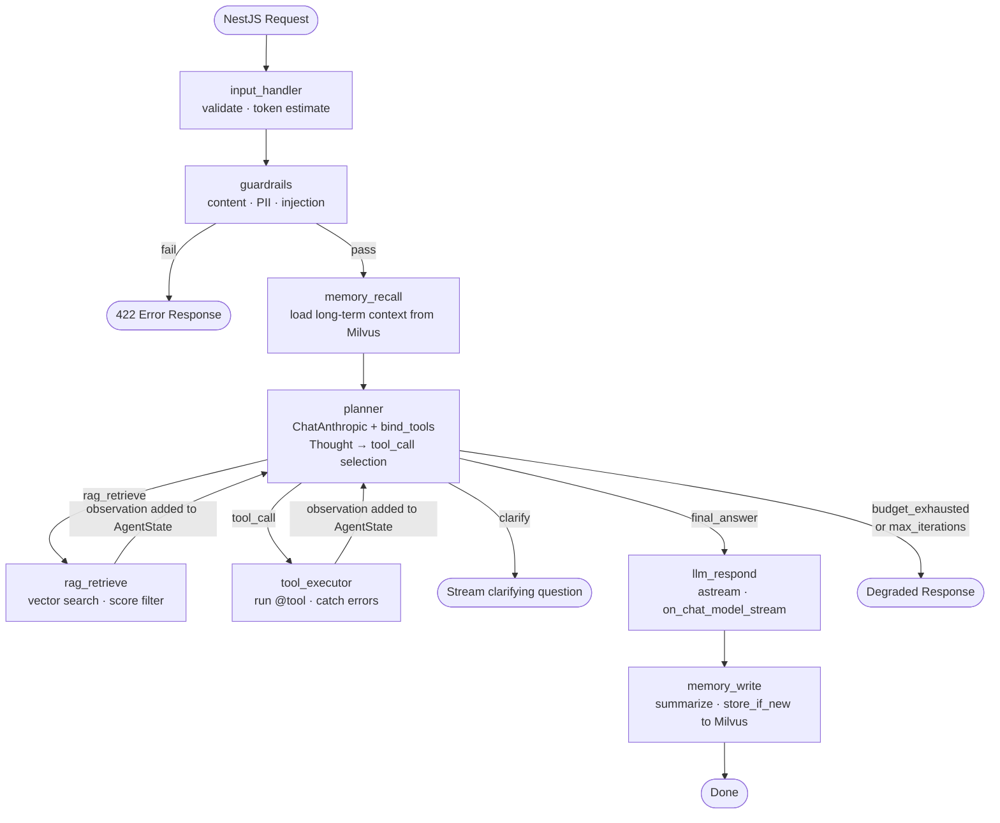

# app-ai — Phase 2: LangGraph Agent (StateGraph)

> **Scope:** This document is a complete guide to upgrading the `app-ai` agent from a manual LangChain loop to a **LangGraph `StateGraph`**.
> **Prerequisite:** You should have completed [app-ai-with-langchain.md](app-ai-with-langchain.md) (Phase 1) first. This document builds on all Phase 1 concepts.
>
> For the full system context (Next.js → NestJS → FastAPI → Claude), see [app-architecture.md](app-architecture.md).

---

## 1. What Changes in Phase 2

Phase 2 replaces `agent_loop.py` (one file with a `for` loop) with three files that define a compiled graph. The external API, all tools, guardrails, RAG, and memory remain **exactly the same** — only the loop internals change.

### What you are replacing

```text
Phase 1 (app-ai-with-langchain.md)          Phase 2 (this document)
────────────────────────────────────────    ──────────────────────────────────────────────
agent/agent_loop.py                    →    agent/state.py   (AgentState TypedDict)
  run() with for loop                  →    agent/nodes.py   (8 async node functions)
  local variables for state            →    agent/graph.py   (StateGraph wiring + routing)
  if/elif for routing                  →    route_after_planner() + add_conditional_edges
  messages.append(ToolMessage(...))    →    node returns partial state; LangGraph merges
  llm.astream() yields in run()        →    astream_events() in router filters tokens
```

### What stays the same (do not change these)

```text
✅ app/guardrails/           — checker.py, content_policy.py, pii_filter.py, injection_detector.py
✅ app/tools/                — registry.py and all @tool files
✅ app/rag/                  — retriever.py, embeddings.py, chunker.py, reranker.py
✅ app/memory/vector_memory.py — VectorMemory class (store, recall, forget)
✅ app/config/settings.py    — Settings class
✅ app/routers/rag.py        — ingest endpoints unchanged
✅ app/schemas/              — AgentRequest and all Pydantic models
✅ app/llm/claude_client.py  — ChatAnthropic singleton + build_messages()
```

---

## 2. Why LangGraph

| Dimension           | Phase 1 — Manual `for` loop                      | Phase 2 — LangGraph `StateGraph`                          |
| ------------------- | ------------------------------------------------ | --------------------------------------------------------- |
| **State tracking**  | Local variables; lost if process crashes         | `AgentState` TypedDict; managed and checkpointed by LangGraph |
| **Routing logic**   | `if/elif tool_name` inside the loop body         | `route_after_planner()` + `add_conditional_edges`         |
| **Loop control**    | `for i in range(MAX_ITERATIONS); break`          | `END` node returned from the router function              |
| **Crash recovery**  | Not supported                                    | `MemorySaver` saves state after every node; resume on restart |
| **Streaming**       | Manual `yield` inside `run()`                    | `astream_events()` — LangGraph fires events automatically |
| **Unit testing**    | Must run the whole loop with mocks               | Each node is a plain `async def` — test with a mock dict  |
| **Visualization**   | None                                             | `agent_graph.get_graph().draw_mermaid()`                  |
| **Parallel nodes**  | Not supported                                    | Supported natively (future expansion)                     |

The API and external behaviour are **identical** between phases — the browser, NestJS, and all tool implementations see no difference.

---

## 3. What Is LangGraph

LangGraph is a library built **on top of LangChain** that models agent logic as a **directed graph**:
- **Nodes** — async Python functions that receive state and return partial updates
- **Edges** — connections between nodes (always taken)
- **Conditional edges** — connections decided at runtime by a router function
- **`AgentState`** — a `TypedDict` that holds all data flowing through the graph; LangGraph passes it between nodes automatically

Your Phase 1 code already uses LangChain (`ChatAnthropic`, `@tool`, typed messages). LangGraph is a natural extension — no new paradigm, just a different way to structure the same logic.

### What LangGraph adds on top of LangChain

```text
StateGraph             builds and compiles the agent graph (replaces the for loop)
AgentState TypedDict   state schema; LangGraph passes and merges it between nodes automatically
MemorySaver            checkpoints AgentState after every node (enables crash recovery)
astream_events()       event stream; filter on_chat_model_stream to forward tokens as SSE
add_conditional_edges  register a router function that returns the next node name at runtime
```

---

## 4. Core Architecture — LangGraph StateGraph

The same Phase 1 steps become **named graph nodes**. LangGraph manages state passing and routing automatically.

```text
                    NestJS Request
                         │
                         ▼
                ┌─────────────────┐
                │  input_handler  │  parse · validate · estimate tokens
                └────────┬────────┘
                         │
                         ▼
                ┌─────────────────┐
                │    guardrails   │  content policy · PII redact · injection detect
                └────────┬────────┘
                    pass │  fail ──────────────────────────► 422 Error
                         ▼
                ┌─────────────────┐
                │  memory_recall  │  load long-term context from Milvus
                └────────┬────────┘
                         │
                         ▼
                ┌─────────────────────────────────────────┐
                │   planner  (ChatAnthropic + bind_tools) │
                │   Thought → Action decision             │
                └──┬──────────┬──────────┬───────────────┘
                   │          │          │
            rag_retrieve  tool_call  final_answer
                   │          │          │
                   ▼          ▼          ▼
            ┌──────────┐ ┌──────────┐ ┌──────────────┐
            │rag_retrie│ │tool_exec │ │  llm_respond │
            │ve        │ │utor      │ │  (astream)   │
            └────┬─────┘ └────┬─────┘ └──────┬───────┘
                 │            │              │
                 └────────────┘              ▼
                      │               ┌──────────────┐
               observation            │ memory_write │  summarize · store to Milvus
                      │               └──────┬───────┘
                      └──► planner           │
                           (next iter)       ▼
                                            END
```

**Key differences from Phase 1:**
- `planner` and each action branch are **separate named Python functions** (nodes), not code inside a `for` loop
- `route_after_planner()` **replaces** the `if/elif tool_name` block
- `AgentState` **replaces** local variables (`messages`, `iterations`, `tokens_used`)
- `rag_retrieve → planner` and `tool_executor → planner` are **declared edges** — no `continue` statement needed

---

## 5. Workflow Diagram



**Reading the diagram:**
- Rectangles = graph **nodes** (async functions that update `AgentState`)
- Rounded rectangles = **terminal** states (graph ends here)
- Arrows = **fixed edges** (always taken) or **conditional edges** (label = routing condition)
- `E → D` and `F → D` = the ReAct loop: every observation feeds back into the planner

---

## 6. AgentState — The Single Source of Truth

`AgentState` replaces all local variables from Phase 1 (`messages`, `iterations`, `tokens_used`). LangGraph holds this dict and passes it into every node function. Nodes return only the fields they change — LangGraph merges them back in automatically.

```python
# app/agent/state.py
#
# AgentState is the complete state for one agent request.
# Every node reads from it and returns a dict of fields to update.
# LangGraph merges those updates back into state — no manual passing needed.

from typing import TypedDict, Annotated
from langgraph.graph.message import add_messages
# add_messages is a "reducer": instead of replacing the history list,
# new messages are APPENDED. This is how conversation history accumulates automatically.

class AgentState(TypedDict):
    # ── Input fields (set once at the start, never mutated) ──────────────────
    user_id:      str
    message:      str
    session_id:   str
    user_context: dict

    # ── Conversation history — Annotated with add_messages reducer ────────────
    # When a node returns {"history": [new_msg]}, LangGraph APPENDS it to the list.
    # Without add_messages, it would REPLACE the list. For conversation, append is correct.
    history: Annotated[list, add_messages]

    # ── State built up during the run ────────────────────────────────────────
    long_term_memory: list[str]    # recalled from Milvus before the loop starts
    rag_documents:    list[str]    # retrieved this request
    iterations:       list[dict]   # Thought/Action/Observation chain (one dict per loop)
    tool_results:     dict         # keyed by tool name — deduplicates repeat calls
    tokens_used:      int          # running token count for budget enforcement
    current_action:   dict         # action the planner chose this iteration

    # ── Output fields ────────────────────────────────────────────────────────
    final_response:   str | None   # streamed answer (None until llm_respond runs)
    error:            str | None   # set by guardrails_node if request is blocked
```

### How node updates work

Each node returns **only the fields it changed**. LangGraph merges the result into the current state.

```python
# Example: tool_executor_node reads state and returns only the fields it updates.

async def tool_executor_node(state: AgentState) -> dict:
    action     = state["current_action"]
    tool_name  = action["name"]
    tool_args  = action.get("args", {})

    tool        = tool_map.get(tool_name)
    observation = await tool.ainvoke(tool_args) if tool else f"Error: unknown tool '{tool_name}'"

    new_iteration = {
        "node":        "tool_executor",
        "tool":        tool_name,
        "args":        tool_args,
        "observation": str(observation),
    }

    # Return ONLY the fields this node changes.
    # LangGraph merges these back into state before routing to the next node.
    return {
        "tool_results": {**state["tool_results"], tool_name: observation},
        "iterations":   state["iterations"] + [new_iteration],
        "tokens_used":  state["tokens_used"] + len(str(observation)) // 4,
    }
    # Everything else in state (user_id, history, rag_documents, ...) is unchanged.
```

---

## 7. Graph Nodes — `nodes.py`

Each Phase 1 code block becomes an independent `async def` function. Each receives `state: AgentState` and returns a `dict` of fields to update.

```python
# app/agent/nodes.py
#
# One function per graph node. Each is independently testable:
# just call it with a mock state dict and check the returned dict.
# No need to run the full graph to unit-test a node.

from app.agent.state import AgentState
from app.guardrails.checker import GuardrailChecker
from app.memory.vector_memory import VectorMemory
from app.rag.retriever import RAGRetriever
from app.tools.registry import TOOLS, tool_map
from app.llm.claude_client import llm, build_messages

guardrails = GuardrailChecker()
vector_mem = VectorMemory()
retriever  = RAGRetriever()


# ── Node 1: Input Handler ─────────────────────────────────────────────────────
async def input_handler(state: AgentState) -> dict:
    """Validate and normalize. Estimate incoming token count."""
    # Token estimation: message + all history content
    token_estimate = len(state["message"]) // 4 + sum(
        len(m.get("content", "")) // 4
        for m in state["history"]
    )
    # Only return fields this node changes.
    return {"tokens_used": token_estimate}


# ── Node 2: Guardrails ────────────────────────────────────────────────────────
async def guardrails_node(state: AgentState) -> dict:
    """Run safety checks. Sets error field if input is blocked."""
    result = guardrails.check(state["message"])
    if not result.passed:
        # Setting error signals route_after_planner() to return END immediately.
        return {"error": result.reason}
    # PII may have been redacted — replace raw message with sanitized version.
    return {"message": result.sanitized_message, "error": None}


# ── Node 3: Memory Recall ─────────────────────────────────────────────────────
async def memory_recall_node(state: AgentState) -> dict:
    """Load long-term user context before the planner runs."""
    # If Milvus is unreachable, recall() returns [] — loop continues without personalization.
    chunks = await vector_mem.recall(state["user_id"], state["message"], top_k=5)
    return {"long_term_memory": [c.content for c in chunks]}


# ── Node 4: Planner ───────────────────────────────────────────────────────────
async def planner_node(state: AgentState) -> dict:
    """Ask Claude what to do next. Returns a structured action via bind_tools()."""
    system_prompt = build_system_prompt(state)
    # build_system_prompt() assembles: agent identity + long_term_memory + tool rules
    messages = build_messages(system_prompt, state["history"])
    # build_messages() returns: [SystemMessage, HumanMessage, AIMessage, ...]

    # bind_tools() attaches tool schemas to this specific LLM call.
    # Claude responds with a structured tool_call block — no text parsing needed.
    response = await llm.bind_tools(TOOLS).ainvoke(messages)
    # response.tool_calls: [{"name": "rag_retrieve", "args": {...}, "id": "tc_001"}]
    # If empty, Claude is ready to give the final answer.

    action = (
        response.tool_calls[0]
        if response.tool_calls
        else {"name": "final_answer", "args": {}}
    )
    return {"current_action": action}


# ── Node 5: RAG Retrieve ──────────────────────────────────────────────────────
async def rag_retrieve_node(state: AgentState) -> dict:
    """Run vector search and record the observation in the iteration chain."""
    query     = state["current_action"].get("args", {}).get("query", state["message"])
    docs      = await retriever.retrieve(query)
    formatted = retriever.format_for_prompt(docs)

    new_iteration = {
        "action":      "rag_retrieve",
        "query":       query,
        "observation": formatted,
    }
    return {
        "rag_documents": [d.content for d in docs],
        "iterations":    state["iterations"] + [new_iteration],
        "tokens_used":   state["tokens_used"] + len(formatted) // 4,
    }
    # Fixed edge in graph.py routes this back to planner automatically.


# ── Node 6: Tool Executor ─────────────────────────────────────────────────────
async def tool_executor_node(state: AgentState) -> dict:
    """Run a registered @tool. Always returns an observation — never raises."""
    action    = state["current_action"]
    tool_name = action["name"]
    tool_args = action.get("args", {})

    tool = tool_map.get(tool_name)
    if tool is None:
        observation = f"Error: unknown tool '{tool_name}'"
    else:
        try:
            observation = await tool.ainvoke(tool_args)
        except Exception as e:
            # Tool errors become observations — the LLM sees them and adapts.
            observation = f"Error: {tool_name} failed — {str(e)}"

    new_iteration = {
        "action":      f"tool_call({tool_name})",
        "args":        tool_args,
        "observation": str(observation),
    }
    return {
        "tool_results": {**state["tool_results"], tool_name: observation},
        "iterations":   state["iterations"] + [new_iteration],
        "tokens_used":  state["tokens_used"] + len(str(observation)) // 4,
    }
    # Fixed edge in graph.py routes this back to planner automatically.


# ── Node 7: LLM Respond ───────────────────────────────────────────────────────
async def llm_respond_node(state: AgentState) -> dict:
    """Stream the final answer. LangGraph emits on_chat_model_stream per token."""
    system_prompt = build_system_prompt(state)
    messages      = build_messages(system_prompt, state["history"])

    # llm.astream() yields AIMessageChunk objects — one per token.
    # Because llm is ChatAnthropic (not the raw SDK), LangGraph intercepts each chunk
    # and fires on_chat_model_stream automatically.
    # The FastAPI router listens for these events and forwards tokens to the SSE stream.
    # No manual `yield` needed here — LangGraph handles event emission.
    full_response = ""
    async for chunk in llm.astream(messages):
        full_response += chunk.content

    return {"final_response": full_response}


# ── Node 8: Memory Write ──────────────────────────────────────────────────────
async def memory_write_node(state: AgentState) -> dict:
    """Summarize and persist useful context from this session to Milvus."""
    if state.get("final_response") and should_store(state):
        summary = summarize_session(state)   # condense to 1-2 sentences
        await vector_mem.store_if_new(state["user_id"], summary, tags=["session"])
    return {}   # no state updates needed — this is the last node before END
```

---

## 8. Graph Construction — `graph.py`

This file wires all nodes together into a compiled, runnable graph. Reading it gives a complete map of the agent's control flow.

```python
# app/agent/graph.py
#
# build_agent_graph() declares every node, every edge, and every routing rule.
# The compiled graph handles all state passing, routing, and checkpointing automatically.

from langgraph.graph import StateGraph, END
# StateGraph = the graph builder class
# END       = special LangGraph constant meaning "stop the graph here"

from langgraph.checkpoint.memory import MemorySaver
# MemorySaver saves AgentState after every node.
# If the server restarts mid-request, the graph can resume from the last saved state
# using the same thread_id (= session_id).

from app.agent.state import AgentState
from app.agent.nodes import (
    input_handler, guardrails_node, memory_recall_node, planner_node,
    rag_retrieve_node, tool_executor_node, llm_respond_node, memory_write_node,
)

MAX_ITERATIONS = 10


# ── Router function ───────────────────────────────────────────────────────────
# Called after every planner_node run. Returns the NAME of the next node.
# This replaces the if/elif block that was inside the manual for loop.

def route_after_planner(state: AgentState) -> str:
    # Guardrails set error → terminate immediately
    if state.get("error"):
        return END

    # Token budget exhausted or iteration cap reached → degrade gracefully
    if state["tokens_used"] >= 193_904 or len(state["iterations"]) >= MAX_ITERATIONS:
        return END

    # Route based on the action name the planner chose this iteration
    action_name = state["current_action"].get("name", "final_answer")
    return {
        "rag_retrieve": "rag_retrieve",   # key = action name, value = next node name
        "tool_call":    "tool_executor",
        "final_answer": "llm_respond",
        "clarify":      END,              # ask user a question → end this turn
    }.get(action_name, END)              # unknown action → safe termination


# ── Graph construction ────────────────────────────────────────────────────────
def build_agent_graph() -> StateGraph:
    graph = StateGraph(AgentState)
    # AgentState TypedDict tells LangGraph the shape of state flowing through the graph.

    # ── Register all nodes ─────────────────────────────────────────────────────
    # String name → async function. LangGraph calls the function and passes AgentState.
    graph.add_node("input_handler",  input_handler)
    graph.add_node("guardrails",     guardrails_node)
    graph.add_node("memory_recall",  memory_recall_node)
    graph.add_node("planner",        planner_node)
    graph.add_node("rag_retrieve",   rag_retrieve_node)
    graph.add_node("tool_executor",  tool_executor_node)
    graph.add_node("llm_respond",    llm_respond_node)
    graph.add_node("memory_write",   memory_write_node)

    # ── Fixed edges (always taken in this order) ───────────────────────────────
    graph.set_entry_point("input_handler")       # where every request enters
    graph.add_edge("input_handler", "guardrails")
    graph.add_edge("guardrails",    "memory_recall")
    graph.add_edge("memory_recall", "planner")

    # ── Conditional edges (decided at runtime by route_after_planner) ──────────
    # After planner_node completes, LangGraph calls route_after_planner(state).
    # The return value is matched against the dict below to find the next node.
    graph.add_conditional_edges(
        "planner",              # source node
        route_after_planner,    # function that returns the next node name as a string
        {
            "rag_retrieve":  "rag_retrieve",
            "tool_executor": "tool_executor",
            "llm_respond":   "llm_respond",
            END:             END,
        }
    )

    # ── Loop edges (after each action, return to planner) ─────────────────────
    # These are the ReAct loop edges — observation feeds back into the planner.
    graph.add_edge("rag_retrieve",  "planner")
    graph.add_edge("tool_executor", "planner")

    # ── Terminal path (stream answer, write memory, stop) ─────────────────────
    graph.add_edge("llm_respond",  "memory_write")
    graph.add_edge("memory_write", END)

    # Compile with MemorySaver — state is saved after every node.
    # Pass thread_id in config when calling astream_events() to link to a checkpoint.
    return graph.compile(checkpointer=MemorySaver())


# Module-level compiled graph — import agent_graph wherever you need to run the agent.
agent_graph = build_agent_graph()
```

---

## 9. FastAPI Endpoint — Streaming SSE

Replace the `run()` import with `agent_graph`. Tokens now come from LangGraph's event stream. Everything else (SSE format, `StreamingResponse`, headers) stays the same.

```python
# app/routers/agent.py  (Phase 2 — LangGraph)
#
# The router's job: parse the request, build the initial AgentState dict,
# and hand it to the compiled graph. The graph handles all routing, memory,
# tools, and LLM calls internally.
#
# Streaming works because ChatAnthropic (in llm_respond_node) fires
# on_chat_model_stream events that astream_events() surfaces here.

from fastapi import APIRouter
from fastapi.responses import StreamingResponse
from app.schemas.request import AgentRequest
from app.agent.graph import agent_graph    # compiled StateGraph
from app.agent.state import AgentState

router = APIRouter(prefix="/v1")

@router.post("/agent/chat")
async def agent_chat(request: AgentRequest):
    # Build the complete initial state — every field in AgentState must be present.
    # LangGraph takes ownership of this dict and passes it through all nodes.
    initial_state: AgentState = {
        "user_id":          request.user_id,
        "message":          request.message,
        "session_id":       request.session_id,
        "user_context":     request.user_context.model_dump(),
        # model_dump() converts the Pydantic UserContext object → plain dict
        "history":          [m.model_dump() for m in request.history],
        # list comprehension: convert each HistoryMessage Pydantic object → dict
        "long_term_memory": [],    # populated by memory_recall_node
        "rag_documents":    [],    # populated by rag_retrieve_node
        "iterations":       [],    # Thought/Action/Observation chain — grows each loop
        "tool_results":     {},    # keyed by tool name — deduplicates repeat calls
        "tokens_used":      0,     # incremented by each node that adds content
        "current_action":   {},    # set by planner_node each iteration
        "final_response":   None,  # set by llm_respond_node
        "error":            None,  # set by guardrails_node if input is blocked
    }

    async def token_stream():
        # astream_events() runs the full graph and yields an event dict for every
        # internal action: node start/end, LLM token, tool call, etc.
        # We filter for on_chat_model_stream — the individual response tokens.
        async for event in agent_graph.astream_events(
            initial_state,
            config={"configurable": {"thread_id": request.session_id}},
            # thread_id links this run to a MemorySaver checkpoint.
            # If the server restarts mid-request, the graph can resume from
            # the last checkpoint using the same session_id.
            version="v2",   # use the latest astream_events schema
        ):
            if event["event"] == "on_chat_model_stream":
                # This event fires once per token from llm_respond_node.
                # event["data"]["chunk"] is an AIMessageChunk object.
                chunk = event["data"]["chunk"].content
                if chunk:   # skip empty chunks (heartbeat packets)
                    yield f"data: {chunk}\n\n"   # SSE format

        yield "data: [DONE]\n\n"   # signals the browser the stream is finished

    return StreamingResponse(
        token_stream(),
        media_type="text/event-stream",
        headers={
            "Cache-Control": "no-cache",    # every token must reach the client immediately
            "X-Accel-Buffering": "no",      # tells Nginx: proxy_buffering off (required for SSE)
        }
    )
```

### What changed vs Phase 1 router

| Phase 1                                       | Phase 2                                                                     |
| --------------------------------------------- | --------------------------------------------------------------------------- |
| `from app.agent.agent_loop import run`        | `from app.agent.graph import agent_graph`                                   |
| `async for token in run(request)`             | `async for event in agent_graph.astream_events(initial_state, ...)`         |
| Token is a plain `str` yielded by `run()`     | Token is `event["data"]["chunk"].content` filtered from `on_chat_model_stream` |
| No `initial_state` dict needed                | Must build complete `AgentState` dict before calling the graph              |

---

## 10. Full Execution Flow

**User asks:** `"What are the benefits of RAG?"`

Same steps as Phase 1, but each is a named **graph node**. LangGraph routes between them automatically via edges.

```text
① NestJS sends POST /v1/agent/chat
   { user_id, message, history, user_context, session_id }
   FastAPI parses body into AgentRequest (Pydantic) → builds initial_state dict

② LangGraph node: input_handler
   └── token_estimate = len(message) // 4 + sum(len(h.content) // 4 for h in history)
   └── returns {"tokens_used": 1240}
   └── LangGraph merges → routes to guardrails (fixed edge)

③ LangGraph node: guardrails
   └── Content policy: PASS
   └── PII check: no PII detected → message unchanged
   └── Injection check: PASS
   └── returns {"message": message, "error": None}
   └── LangGraph merges → routes to memory_recall (fixed edge)

④ LangGraph node: memory_recall
   └── recall(user_id, message, top_k=5) from Milvus user_memory collection
   └── Returns 2 chunks: "User prefers bullet points", "User works in finance"
   └── returns {"long_term_memory": ["User prefers bullet points", "User works in finance"]}
   └── LangGraph merges → routes to planner (fixed edge)

⑤ LangGraph node: planner  (iteration 1)
   └── build_system_prompt(state) — includes long_term_memory
   └── build_messages(system_prompt, state["history"]) → typed message list
   └── llm.bind_tools(TOOLS).ainvoke(messages)
   └── Claude responds: tool_call → rag_retrieve(query="benefits of RAG systems")
   └── returns {"current_action": {"name": "rag_retrieve", "args": {"query": "..."}}}
   └── route_after_planner(state) → "rag_retrieve"
   └── LangGraph routes to rag_retrieve node (conditional edge)

⑥ LangGraph node: rag_retrieve
   └── embedder.embed(query) → 1536-dim vector
   └── Milvus similarity search → 5 candidates (scores 0.89–0.94)
   └── 4 chunks above MIN_SCORE=0.72 returned
   └── returns {
         "rag_documents": [...],
         "iterations": [{"action": "rag_retrieve", "observation": "..."}],
         "tokens_used": 1240 + 820 = 2060
       }
   └── LangGraph merges → routes back to planner (fixed edge)

⑦ LangGraph node: planner  (iteration 2)
   └── Full AgentState injected — planner sees rag_retrieve result in state["iterations"]
   └── llm.bind_tools(TOOLS).ainvoke(messages)
   └── Claude responds: tool_calls=[] with name="final_answer"
   └── returns {"current_action": {"name": "final_answer", "args": {}}}
   └── route_after_planner(state) → "llm_respond"
   └── LangGraph routes to llm_respond node (conditional edge)

⑧ LangGraph node: llm_respond
   └── llm.astream(messages) → yields AIMessageChunk per token
   └── LangGraph fires on_chat_model_stream event per chunk automatically
   └── FastAPI router:
         async for event in agent_graph.astream_events(...):
           if event["event"] == "on_chat_model_stream":
             yield f"data: {event['data']['chunk'].content}\n\n"
   └── Browser renders tokens in real time
   └── returns {"final_response": "<full answer text>"}
   └── LangGraph routes to memory_write (fixed edge)

⑨ LangGraph node: memory_write  (runs after stream completes)
   └── should_store(state) → True (question + answer worth saving)
   └── summary = "User asked about RAG benefits. Provided 4-point bullet answer."
   └── store_if_new(user_id, summary, tags=["session"]) → written to Milvus
   └── returns {}
   └── LangGraph reaches END

⑩ FastAPI yields "data: [DONE]\n\n" → NestJS receives stream end signal
   NestJS saves full response to PostgreSQL
```

**Key difference from Phase 1:** Steps ⑥→⑦ are controlled by a **fixed graph edge** (`rag_retrieve → planner`) declared once in `build_agent_graph()`. In Phase 1, the same transition required `messages.append(ToolMessage(...))` and `continue` inside the loop body.

---

## 11. Error Handling

| Failure Point               | Behaviour                                                                                              | User Impact                                                         |
| --------------------------- | ------------------------------------------------------------------------------------------------------ | ------------------------------------------------------------------- |
| Guardrails block            | `guardrails_node` sets `state["error"]` → `route_after_planner` returns `END` → FastAPI 422           | Immediate error message                                             |
| Tool error                  | `tool_executor_node` catches exception → returns error string as observation                           | LLM sees error observation and adapts; may try a different tool     |
| RAG retrieval fails         | `rag_retrieve_node` returns `[]` → observation = "No relevant documents found"                         | LLM answers from training data only                                 |
| Token budget exhausted      | `route_after_planner` returns `END` → FastAPI sends graceful fallback                                  | User receives fallback message                                      |
| Max iterations reached      | `route_after_planner` returns `END` → FastAPI sends graceful fallback                                  | User receives fallback message                                      |
| Claude API error            | `planner_node` or `llm_respond_node` raises → LangGraph propagates exception → NestJS returns 503     | Standard error response                                             |
| Pydantic validation error   | FastAPI raises `RequestValidationError` before graph starts → 422                                      | Immediate schema error                                              |
| Milvus unreachable (recall) | `memory_recall_node` catches error → returns `{"long_term_memory": []}`                                | Agent continues without personalization                             |
| Milvus unreachable (write)  | `memory_write_node` catches error → logs warning, returns `{}`                                         | Session completed; memory not persisted for next session            |
| Server restart mid-request  | `MemorySaver` checkpoint exists → graph resumes from last completed node using same `thread_id`        | Transparent to user (Phase 1 would lose all progress)               |

---

## 12. Project Folder Structure

### Phase 2 — changes from Phase 1

Replace `agent_loop.py` with three files. Everything else stays the same.

```
app-ai/
├── app/
│   ├── agent/
│   │   ├── agent_loop.py    ← DELETE this file (replaced by the three below)
│   │   │
│   │   ├── state.py         NEW — AgentState TypedDict (replaces local loop variables)
│   │   ├── nodes.py         NEW — 8 async node functions (one per graph step)
│   │   ├── graph.py         NEW — StateGraph construction, routing, MemorySaver compile
│   │   └── token_budget.py  (unchanged — budget logic still used inside nodes.py)
│   │
│   └── routers/
│       └── agent.py         UPDATE — swap agent_loop.run() for agent_graph.astream_events()
│
│   (all other folders unchanged from Phase 1)
```

### Complete Phase 2 folder

```
app-ai/
├── app/
│   ├── main.py
│   ├── routers/
│   │   ├── agent.py                     UPDATED — astream_events() router
│   │   └── rag.py                       unchanged
│   ├── schemas/
│   │   ├── request.py                   unchanged
│   │   └── response.py                  unchanged
│   ├── guardrails/
│   │   ├── checker.py                   unchanged
│   │   ├── content_policy.py            unchanged
│   │   ├── pii_filter.py                unchanged
│   │   └── injection_detector.py        unchanged
│   ├── agent/
│   │   ├── state.py                     NEW — AgentState TypedDict
│   │   ├── nodes.py                     NEW — 8 node functions
│   │   ├── graph.py                     NEW — StateGraph + route_after_planner
│   │   └── token_budget.py              unchanged
│   ├── tools/
│   │   ├── registry.py                  unchanged
│   │   ├── web_search.py                unchanged
│   │   ├── code_exec.py                 unchanged
│   │   ├── calculator.py                unchanged
│   │   └── database.py                  unchanged
│   ├── memory/
│   │   └── vector_memory.py             unchanged
│   ├── rag/
│   │   ├── retriever.py                 unchanged
│   │   ├── embeddings.py                unchanged
│   │   ├── chunker.py                   unchanged
│   │   └── reranker.py                  unchanged
│   ├── llm/
│   │   └── claude_client.py             unchanged
│   └── config/
│       └── settings.py                  unchanged
├── tests/
│   ├── unit/
│   │   ├── test_guardrails.py           unchanged
│   │   ├── test_nodes.py                NEW — test each node with a mock state dict
│   │   ├── test_graph.py                NEW — test route_after_planner()
│   │   ├── test_token_budget.py         unchanged
│   │   └── test_retriever.py            unchanged
│   └── integration/
│       ├── test_graph_loop.py           NEW — run full graph with mock LLM
│       └── test_rag_pipeline.py         unchanged
├── pyproject.toml
├── Dockerfile
└── .env.example
```

---

## 13. Phase 1 → Phase 2 Migration Map

| Phase 1 (agent_loop.py)                   | Phase 2 (graph.py + nodes.py)                                              |
| ----------------------------------------- | -------------------------------------------------------------------------- |
| `for i in range(MAX_ITERATIONS)`          | `route_after_planner` checks `len(state["iterations"]) >= MAX_ITERATIONS`  |
| `if not response.tool_calls: break`       | `route_after_planner` returns `"llm_respond"` when action = `final_answer` |
| `if/elif tool_name == "rag_retrieve"`     | `route_after_planner` dict: `{"rag_retrieve": "rag_retrieve", ...}`        |
| Local `messages` list, appended manually  | `AgentState["history"]` with `add_messages` reducer                        |
| `messages.append(ToolMessage(...))`       | `rag_retrieve_node` / `tool_executor_node` return `{"iterations": [...]}`  |
| Local `iterations` list                   | `AgentState["iterations"]` updated by each node                            |
| `tokens_used += n` inside the loop        | Node returns `{"tokens_used": state["tokens_used"] + n}`                   |
| `async for chunk in llm.astream(): yield` | `llm.astream()` in `llm_respond_node`; tokens via `astream_events()`       |
| No crash recovery                         | `MemorySaver` + `thread_id` → resume on restart                            |

---

## 14. Unit Testing Nodes

Because each node is a plain `async def` function, you can test it with a mock state dict — no need to run the full graph.

```python
# tests/unit/test_nodes.py

import pytest
from app.agent.nodes import guardrails_node, tool_executor_node

@pytest.mark.asyncio
async def test_guardrails_passes_clean_input():
    state = {
        "message": "What are the benefits of RAG?",
        # ... other required AgentState fields ...
    }
    result = await guardrails_node(state)
    assert result["error"] is None
    assert result["message"] == state["message"]   # unchanged

@pytest.mark.asyncio
async def test_tool_executor_handles_unknown_tool():
    state = {
        "current_action": {"name": "nonexistent_tool", "args": {}},
        "tool_results": {},
        "iterations": [],
        "tokens_used": 0,
    }
    result = await tool_executor_node(state)
    assert "Error: unknown tool" in result["iterations"][0]["observation"]
    # LLM sees this error as an observation — it never crashes the graph.
```

---

## 15. Token Budget Management

Same logic as Phase 1 (`token_budget.py` is unchanged). In Phase 2, budget checking happens inside `route_after_planner()` and inside each node that adds content.

```python
# route_after_planner() in graph.py enforces the hard limit:
if state["tokens_used"] >= 193_904 or len(state["iterations"]) >= MAX_ITERATIONS:
    return END   # graph terminates; FastAPI sends fallback message

# Each node that adds content updates tokens_used:
return {
    "iterations":  state["iterations"] + [new_iteration],
    "tokens_used": state["tokens_used"] + len(str(observation)) // 4,
}
```

---

## 16. Configuration

No changes from Phase 1. Add the LangGraph dependencies below.

```python
# app/config/settings.py — unchanged from Phase 1
```

```toml
# pyproject.toml — add langgraph
[tool.poetry.dependencies]
python              = "^3.11"
fastapi             = "^0.111"
uvicorn             = "^0.29"
pydantic            = "^2.7"
pydantic-settings   = "^2.2"
langchain-anthropic = "^0.1"
langchain-core      = "^0.3"
langgraph           = "^0.2"       # NEW — StateGraph, MemorySaver, astream_events
pymilvus            = "^2.4"
openai              = "^1.30"
langchain-text-splitters = "^0.2"
langfuse            = "^2.0"
tavily-python       = "^0.3"
```

```bash
# Install new dependencies
pip install langgraph
```

```ini
# .env.example — unchanged from Phase 1
ANTHROPIC_API_KEY=sk-ant-...
OPENAI_API_KEY=sk-...
MILVUS_HOST=milvus
MILVUS_PORT=19530
TAVILY_API_KEY=tvly-...
LANGFUSE_PUBLIC_KEY=pk-lf-...
LANGFUSE_SECRET_KEY=sk-lf-...
```

---

## 17. Observability

Langfuse works with LangGraph via a callback handler. Each node becomes a span automatically.

```python
# app/agent/graph.py  (with observability)

from langfuse.callback import CallbackHandler

langfuse_handler = CallbackHandler()   # reads LANGFUSE_PUBLIC/SECRET_KEY from env

# In the router — pass the handler as a callback in astream_events config:
async for event in agent_graph.astream_events(
    initial_state,
    config={
        "configurable": {"thread_id": request.session_id},
        "callbacks":    [langfuse_handler],   # LangGraph calls this on every node + LLM call
    },
    version="v2",
):
    ...
```

**What Langfuse automatically captures with LangGraph:**

- One trace per request (from the graph run)
- One span per node (input state + output state + duration)
- One span per LLM call (model, tokens, latency)
- One span per tool call (name, args, result)

---

## 18. Production Enhancements

### Streaming passthrough

Same as Phase 1 — every layer must be configured to not buffer SSE responses:

| Layer   | Required configuration                                           |
| ------- | ---------------------------------------------------------------- |
| FastAPI | `StreamingResponse(generator, media_type="text/event-stream")`   |
| NestJS  | `upstream.data.pipe(res)` — never `await` the full response      |
| Nginx   | `proxy_buffering off; proxy_cache off; proxy_read_timeout 300s;` |

### Graph visualization

LangGraph can render the graph as a Mermaid diagram for documentation:

```python
# In a script or notebook:
from app.agent.graph import agent_graph

print(agent_graph.get_graph().draw_mermaid())
# Copy the output into a Markdown file with ```mermaid ... ``` to render it.
```

### Crash recovery

`MemorySaver` saves `AgentState` after every node. To resume a failed request:

```python
# The same session_id (= thread_id) automatically resumes from the last checkpoint.
# No code change needed — MemorySaver handles this transparently.
async for event in agent_graph.astream_events(
    initial_state,
    config={"configurable": {"thread_id": request.session_id}},
    version="v2",
):
    ...
```

### Tool sandboxing

Same as Phase 1 — code execution tools must run in an isolated subprocess:

```python
# app/tools/code_exec.py — unchanged from Phase 1
import subprocess, resource

result = subprocess.run(
    ["python3", "-c", user_code],
    capture_output=True,
    timeout=10,
    preexec_fn=lambda: resource.setrlimit(
        resource.RLIMIT_AS,
        (256 * 1024 * 1024, 256 * 1024 * 1024)   # 256 MB memory limit
    )
)
```

---

## 19. Key Architectural Principles

1. **Stateless by design.** `app-ai` receives full context on every call. `AgentState` lives only for the duration of one graph run. Persistent state lives in NestJS/PostgreSQL and Milvus.

2. **Guardrails run before the LLM.** `guardrails_node` runs before `planner_node` and cannot be bypassed. Setting `state["error"]` terminates the graph via `route_after_planner`.

3. **Tool failures return observations, not exceptions.** `tool_executor_node` wraps tool calls in `try/except`. Errors become observations the LLM sees and adapts to. The graph never raises from a tool failure.

4. **Token budget is enforced per-node.** Each node that adds content increments `state["tokens_used"]`. `route_after_planner` terminates the graph before any LLM call that would exceed the limit.

5. **Max iterations is a hard limit.** `route_after_planner` checks `len(state["iterations"]) >= MAX_ITERATIONS` and returns `END`. Runaway loops are not retried.

6. **`app-ai` never validates auth.** NestJS validates JWT and passes only `user_id`. No auth logic belongs in Python.

7. **Long-term memory write happens after streaming.** `memory_write_node` runs after `llm_respond_node` — the fixed edge `llm_respond → memory_write` guarantees this order. Users never wait for Milvus writes.

8. **Each node is independently testable.** Nodes are plain `async def` functions. Pass a mock state dict, check the returned dict. No graph setup needed for unit tests.

---

## 20. Cross-references

| Topic                                            | Document                                                             |
| ------------------------------------------------ | -------------------------------------------------------------------- |
| Phase 1 — LangChain manual loop (start here)     | [app-ai-with-langchain.md](app-ai-with-langchain.md)                 |
| Full system architecture (all tiers)             | [app-architecture.md](app-architecture.md)                           |
| Memory deep-dive (scopes, rules, GDPR)           | [agent-memory.md](agent-memory.md)                                   |
| RAG deep-dive (chunking, ingestion, re-ranking)  | [agent-rag.md](agent-rag.md)                                         |
| NestJS → FastAPI communication                   | [app-architecture.md § Communication Protocols](app-architecture.md) |
| Streaming configuration (Nginx, NestJS, FastAPI) | [app-architecture.md § Streaming rule](app-architecture.md)          |
