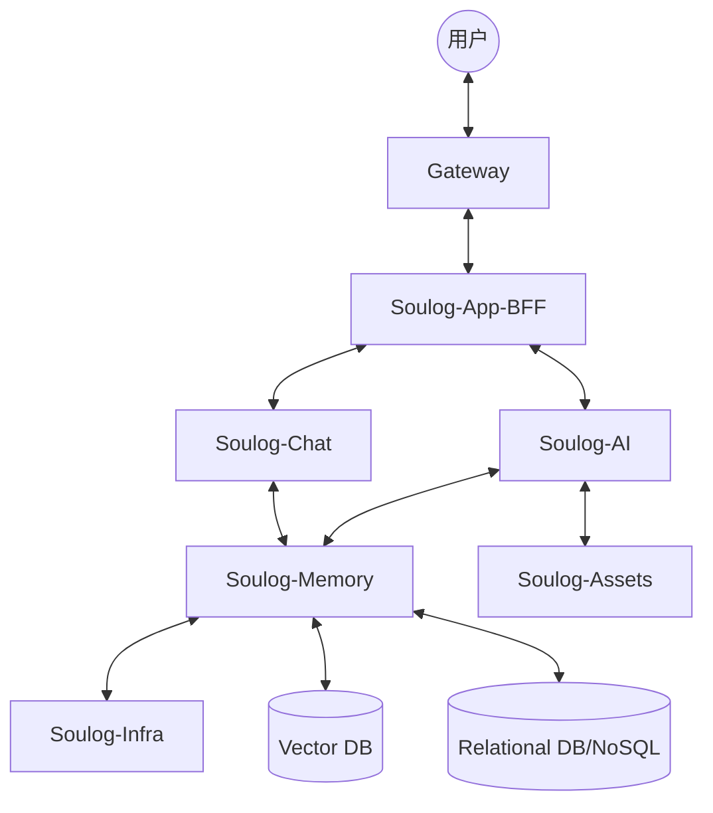
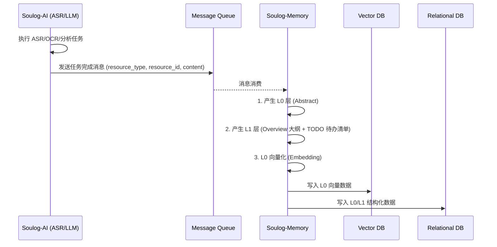
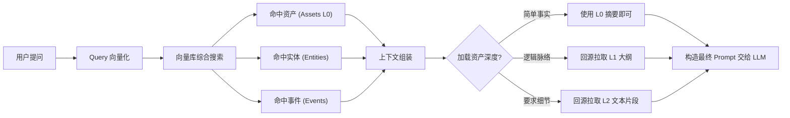
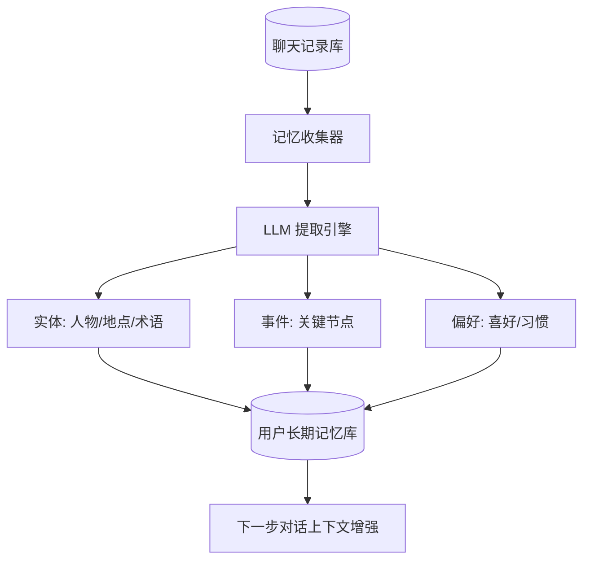
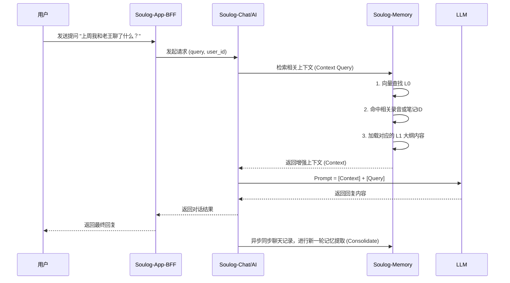

# soulog-memory 详细设计文档

本文档参考 OpenViking 架构，为 soulog 设计 RAG (Retrieval-Augmented Generation) 与 Memory 层，旨在为 AI 助手提供结构化、层次化且可进化的记忆能力。

---

## 1. 整体服务架构

系统采用分层架构组合，确保职责单一与高性能：



| 组件名称             | 职责描述                                                                                       |
| :------------------- | :--------------------------------------------------------------------------------------------- |
| **Gateway**          | 统一入口，负责鉴权、限流、路由、日志记录。                                                     |
| **Soulog-App-BFF**   | 业务逻辑组装，面向前端提供聚合接口，调用 `Chat` 或 `AI` 服务。                                 |
| **Soulog-Chat / AI** | **中台服务**。处理对话逻辑或 AI 任务。`AI` 服务执行 ASR/OCR 任务并发送任务完成消息至 MQ。      |
| **Soulog-Memory**    | **核心记忆层**。监听 MQ 消息，异步生成资源索引 (L0/L1) 与向量召回。通过 `Infra` 获取基础支持。 |
| **Soulog-Assets**    | 资产管理，负责原始文件（录音、文档、截屏）存储。                                               |
| **Soulog-Infra**     | 基础设施服务，提供基础能力支撑。                                                               |

---

## 2. 数据流向说明

### 2.1 资源分类与处理逻辑

系统对不同来源的数据进行分类，并采用统一的消息驱动机制进行索引：

| 资源类别                  | 原始来源        | 处理触发点         | 核心处理逻辑                      |
| :------------------------ | :-------------- | :----------------- | :-------------------------------- |
| **录音文件 (Recordings)** | `soulog-assets` | ASR 任务完成消息   | 生成 L0(摘要) / L1(大纲) / 向量化 |
| **笔记 (Notes)**          | `soulog-assets` | 用户保存/更新消息  | 实时生成语义索引                  |
| **截屏 (Screenshots)**    | `soulog-assets` | OCR/多模态分析消息 | 提取文字/场景描述并进行向量化     |

### 2.2 消息驱动索引流程 (Message-Driven Ingestion)

索引流程由消息队列 (MQ) 驱动，确保系统的高可用与解耦：



#### 消息结构详细说明

为了保证 AI 分析服务与 Memory 层之间的稳定协同，系统统一了通过 MQ 传递的任务完成消息的数据结构（JSON 格式）。以 ASR 转写任务完成为例，典型的消息 Payload 如下：

```json
{
  "message_id": "msg_8a9b7c6d", // 消息唯一ID，用于消费端的幂等控制 (Idempotency)
  "timestamp": 1772522051, // 消息生成时间戳
  "resource_id": 1772522051, // 关联资产的业务关系库主键 ID (如某条音频、笔记或绘画的 ID)
  "resource_type": "audio", // 资产类型标识：audio / note / image / session 等
  "payload": {
    // 随具体 action 变化的扩展数据元
    "segments_count": 5, // (音频分段特定字段) ASR 识别切分出的片段总数
    "duration_seconds": 120 // (音频/视频特定字段) 被处理媒体的总时长
  }
}
```

- **重试与幂等保证**：因为 `Memory` 的核心步骤（生成内容的大纲和摘要插入 DB 或 VectorDB）本身可能是非幂等的，所以必须借助 `message_id` 和 `resource_id` 作为唯一键判断消费记录，防范网络波动或重复投递产生的数据冗余。

---

## 3. 存储与目录结构 (L0 -> L1 -> L2)

参考 OpenViking 的文件系统范式，将知识与记忆划分为三个粒度。

### 3.1 层次化结构定义

| **L0** | **Abstract** | ~100 Tokens | 核心关键词、一句话摘要、元数据标签。 | Vector DB + GCS | **Top (语义索引)** |
| **L1** | **Overview** | ~2000 Tokens | 章节大纲、主要事实清单、逻辑脑图。 | GCS | Middle (主要上下文) |
| **L1** | **TODOs** | 变长 | 从通话、会议中提取的具体行动待办事项。 | GCS + 关系数据库 | High (任务追踪追踪) |
| **L2** | **Detail** | 完整长度 | 原始转写全文、详细细节、时间戳。 | GCS + 关系数据库 | Bottom (追溯原文) |

### 3.2 文件存储目录结构

参考 OpenViking 的目录范式，并结合当前业务需求（暂不实现 Agent），设计如下文件存储目录结构。其中 `resources` 调整为 `assets` 表示资产，每个具体的资产下分类管理其不同维度的内容：

```text
/data (根存储路径)
└── {user_id} (用户独立隔离空间，如具体的user_id或default)
    ├── assets (资产目录)
    │   └── {asset_id} (具体资产的唯一标识，如某次录音或某篇文档的ID)
    │       ├── abstract.md (L0层：一句话摘要、核心关键词等概要信息)
    │       ├── overview.md (L1层：章节大纲、脑图等结构化内容)
    │       ├── todos.json (L1层：从资产中提取的待办事项合集，便于应用层展示)
    │       ├── content.md (L2层：资产的完整文本内容，如全文转录、全量笔记等)
    │       ├── asr (仅包含音频转写后的文本内容及解析结果，不包含原始音频文件)
    │       │   ├── segment_1 (ASR 识别片段 1)
    │       │   └── segment_2 (ASR 识别片段 2)
    │       ├── notes (包含笔记相关的结构化文件)
    │       └── screenshoot (仅包含截屏解析提取后的文本及结构化内容，不包含原始图片文件)
    ├── session (用户对话会话记录)
    │   └── {session_id} (会话唯一标识)
    │       └── messages.jsonl (对话交互上下文明细)
    └── user (用户维度的沉淀数据)
        └── memories (沉淀的长期记忆元数据)
            ├── entities (提取的实体信息，如人物、地点)
            ├── events (提取的历史事件信息)
            └── preferences (提炼的用户偏好与习惯)
```

### 3.3 统一资源访问接口 (参考 VikingFS 范式)

基于 OpenViking 的设计理念，所有底层文件资产（统一且唯一存储在 **Google Cloud Storage (GCS)** 中）向内部应用暴露一层统一的虚拟文件系统（VFS）抽象。业务服务通过标准化的 URI 和方法协议访问数据，避免直接耦合底层存储的 SDK。

#### 1. 资源 URI 定义

所有的文件及目录均使用统一的 VFS Scheme 进行寻址：
`vfs://{user_id}/assets/{asset_id}/...`

- **协议头**: `vfs://` (Virtual File System)
- **底层映射**: 真实物理存储映射至指定的 GCS bucket，例如映射为 `gs://soulog-data-bucket/{user_id}/assets/{asset_id}/...`

#### 2. 核心访问接口

针对数据的访问，服务层（如 `Soulog-Infra` 或 `Soulog-Memory` 内部工具类）应提供类似 POSIX 文件系统的标准操作原语，以便上层逻辑（加载 L1/L2 等）无缝调用：

| 接口名称           | 参数示例                                        | 描述与功能                                                       |
| :----------------- | :---------------------------------------------- | :--------------------------------------------------------------- |
| **`ls` (List)**    | `vfs://{user_id}/assets/{asset_id}/asr`         | 列出指定目录下的所有文件或片段 (segment)，返回文件列表及元数据。 |
| **`cat` (Read)**   | `vfs://{user_id}/assets/{asset_id}/abstract.md` | 读取特定资源文件的完整内容或以流的形式返回。                     |
| **`put` (Write)**  | `vfs://{user_id}/assets/{asset_id}/overview.md` | 写入新资源，或覆盖已有资源内容。                                 |
| **`del` (Delete)** | `vfs://{user_id}/assets/{asset_id}`             | 删除指定的文件，或者递归级联删除整个资源目录。                   |

该抽象层同时也集中处理与 GCS 通信的鉴权配置、网络重试策略以及大型文件的分块读写逻辑。

### 3.4 L0 与 L1 的提取 Prompt 设计

在 Memory 层消费到“资产处理完成”的 MQ 消息后，会调用 LLM 对提取出的完整 `content.md` (L2) 进行总结提炼，生成 L0 和 L1。为保证数据结构的稳定输出（比如强制 JSON 格式），Prompt 的设计遵循以下原则：

#### 1. L0 (Abstract) 提取 Prompt 设计

- **系统定位**：作为资产的纯语义索引，极致浓缩。
- **System Prompt 示例**：

  ````markdown
  # ROLE

  你是一个专业的内容提炼专家。你的任务是通读用户提供的源文件内容（会议、录音或笔记全文），将其提炼为供向量库检索的核心索引（Abstract）。

  # GUIDELINES

  1. 必须输出 3~5 个极具代表性的**核心关键词**。
  2. 必须输出一句涵盖 5W1H（谁、何时、何地、做了什么、结果如何）的**一句话摘要**（大约 50~100 字）。
  3. 绝对不要包含寒暄、废话与主观推断。直接陈述客观事实。
  4. 必须以严格的 JSON 格式输出，不要包含 Markdown 代码块的包裹语法(` ```json `)。

  # OUTPUT FORMAT

  {
  "keywords": ["关键词1", "关键词2"],
  "abstract": "在这里输出一句话摘要内容..."
  }
  ````

#### 2. L1 (Overview 大纲/脑图) 提取 Prompt 设计

- **系统定位**：作为长文档在中间层的阅读大纲，用于填充 LLM 上下文的主逻辑脉络。
- **System Prompt 示例**：

  ```markdown
  # ROLE

  你是一个资深的速记与结构化分析专家。你的任务是将冗长、口语化的源文件内容重新组织成极具逻辑性的 Markdown 大纲（Overview）。

  # GUIDELINES

  1. 识别并归纳出源文件中的主要话题区块，作为一级标题 (`##`)。
  2. 在每个一级标题下，使用无序列表 (`- `) 提炼出属于该板块的 3~5 个**核心事实点或结论**。
  3. 保留重要的专业术语、人名和关键实体名称。
  4. 不要输出任何寒暄或前置语，直接输出纯 Markdown 内容。
  ```

#### 3. L1 (TODOs 待办事项) 提取 Prompt 设计

- **系统定位**：专门剥离并提取出文件中所有的指令级动作和承诺，服务于任务追踪。
- **System Prompt 示例**：

  ```markdown
  # ROLE

  你是一个敏锐的项目管理助手。你的任务是从源文件中敏锐地捕捉所有的“待办事项”、“承诺动作”、“分配的任务”（TODOs）。

  # GUIDELINES

  1. 扫描全文，找出所有表示“将来会做”、“需要去办”、“安排给某人”的具体事项。
  2. 对于每个事项，尝试推理出**负责人 (assignee)**（如果未提及则为 null）和**截止时间 (deadline)**（如果未提及则为 null）。
  3. 如果发现这篇文本纯粹是闲聊或客观描述，没有任何待办动作，请返回一个空的 JSON 数组 `[]`。
  4. 必须以严格的 JSON 格式输出，不要包含任何前后缀及 Markdown 包装。

  # OUTPUT FORMAT

  [
  {
  "task": "梳理并输出 Redis 缓存一致性落地方案的设计文档",
  "assignee": "老王",
  "deadline": "下周三前"
  }
  ]
  ```

### 3.5 统一元数据 (Meta) 结构设计

为了在底层对象存储（GCS）和上层关系型数据库（Relational DB）之间建立可靠的映射和追溯机制，系统**不再维护独立存放的 `meta.json` 文件**。相反，我们充分利用 GCS 原生支持存储对象自定义元数据（Custom Metadata）的特性，将 meta 信息直接绑定在资产实体（如 `content.md` 或 `messages.jsonl`）的存储对象属性上。

**GCS Metadata 示例结构设计：**

```json
{
  "resource_id": 1772522051, // 当前资源存储在关系数据库中的唯一id
  "resource_type": "audio", // 资源类型，如 audio(录音) / audio_segments（录音片段）, note(笔记), session(会话) 等
  "created_at": 1772522051 // 资源创建时间戳
}
```

---

## 4. 向量存储与召回策略

### 4.1 向量数据结构定义

通过 Embedding 将 L0 层的摘要或段落向量化后，统一存储在 Vector DB（如 Milvus / Qdrant 等）中。一条记录的基础数据结构（Schema）设计如下：

| 字段名称            | 类型      | 示例值                                | 说明                                                                                                               |
| :------------------ | :-------- | :------------------------------------ | :----------------------------------------------------------------------------------------------------------------- |
| **`id`**            | `int64`   | `10203040`                            | 向量记录的主键，通常为自动递增或 UUID Hash。                                                                       |
| **`vector`**        | `float[]` | `[0.12, -0.45, ...]`                  | L0 文本经过模型计算（Embedding）得到的密集向量数组。                                                               |
| **`asset_id`**      | `string`  | `"ass_123456789"`                     | 业务上的基本资源单元 ID（如归属的具体某次录音、某篇文档），用于限定召回范围与回溯。                                |
| **`resource_id`**   | `int64`   | `1772522051`                          | 关联的关系型数据库资源 ID (参考 meta 设计中的 resource_id)，例如录音中的某个具体片段ID。                           |
| **`resource_type`** | `string`  | `"audio"`                             | 资源的归属类型，如 audio, note, image 等。                                                                         |
| **`vfs_uri`**       | `string`  | `"vfs://usr_123/assets/456"`          | 向量对应的底层归属资源在虚拟文件系统 (VFS/GCS) 中的统一访问路径。                                                  |
| **`user_id`**       | `int64`   | `12345`                               | 归属用户的唯一 ID。常用于召回时的**租户级过滤 (Tenant Filtering)**，防止数据越权。                                 |
| **`text`**          | `string`  | `"我们在会议中决定采用微服务架构..."` | **(可选 / 极短文本)** Embedding 的原始极短文本（如一句话摘要）。为了减少查询反查回原数据库的延迟可直接冗余此字段。 |
| **`created_at`**    | `int64`   | `1772522051`                          | 向量记录入库的时间戳，可用于根据时间范围过滤旧数据或做遗忘机制。                                                   |

**原则**: **只索引 L0 向量**，确保检索速度最快且语义最聚合。

### 4.2 召回工作流

召回旨在将分布在各个维度的碎片化信息在回答问题前聚合，形成结构化的 Context 交由大模型（LLM）进行推理。

#### 1. 召回决策与路由



#### 2. 不同维度内容的召回处理与组装示例

当用户发起 Query（如：“_上周五我和老王在浦东开会，定了什么技术设计方案？_”），系统会在向量库和传统搜索引擎中同时召回出多个维度的片段。它们各自的处理方式如下：

**场景 A：召回命中资产 (Assets - 会议录音/会议记录)**

- **数据状态**：通过向量比对命中了某录音资产的 `abstract.md` (L0)。
- **处理方式**：
  1. 通过元数据判定属于核心参考内容。
  2. 根据提问深度，动态决定是否通过 `vfs_uri` (如 `vfs://usr_abc/assets/ass_123/overview.md`) 去 GCS 实时加载 L1 (大纲) 或特定 L2 (全文段落)。
- **组装到 Prompt 中**：
  > `[会议记录 - 资产ID: ass_123]`
  > _摘要：团队讨论了后端的微服务划分方案。_
  > _(若加载了 L1)_ _大纲要点：1. 拆分网关层； 2. 解耦存储服务； 3. 制定新的 API 标准。_

**场景 B：召回命中实体 (Entities - 老王 / 浦东)**

- **数据状态**：从 `/user/{user_id}/memories/entities/` 中召回了“老王”的相关记忆块。
- **处理方式**：实体数据通常很轻量，重点在于**身份与关系**的对齐，补全 LLM 对上下文中代词的理解。它不需要回源加载巨型文件，直接作为“背景常识”前置。
- **组装到 Prompt 中**：
  > `[人物背景知识]`
  > _老王：用户的前同事，现任某大厂架构师，擅长分布式系统设计。之前多次参与用户的架构评审。_

**场景 C：召回命中事件 (Events)**

- **数据状态**：从 `/user/{user_id}/memories/events/` 召回了与“上周五开会”相关的一句话事件节点。
- **处理方式**：事件通常用于**时间轴校准**。当问题涉及时间线（上周、去年）时，用事件节点帮助 LLM 锁定特定时间窗。
- **组装到 Prompt 中**：
  > `[历史事件时间轴]`
  >
  > - _日期：2026-02-27 (上周五)_
  > - _事件：在浦东世纪大道某咖啡馆与老王进行了架构白板推演。_

**场景 D：召回限定资产范围的具体细节查询 (带资产级别强过滤的场景)**

- **用户行为/Query**：用户在界面上主动勾选了三份录音（如 A项目启动会、B需求评审会、C架构周会），然后提问：“_这三个会议里，哪几次讨论了关于 Redis 缓存的一致性问题，具体是怎么说的？_”
- **数据状态与处理**：
  1. 系统提取提问的文本（“Redis 缓存的一致性问题”）进行 Embedding。
  2. 在向量库查询时进行 **Metadata 强过滤（预过滤 Pre-filtering）**：不仅过滤 `user_id == 12345`，还通过 `IN` 条件强过滤 `asset_id IN ['ass_A', 'ass_B', 'ass_C']` 且 `resource_type == "audio"`。
  3. 向量引擎返回了若干命中片段（即音频中的特定 segment）。每条记录包含 `resource_id` (具体分段ID) 和 `vfs_uri` (如 `vfs://usr_123/assets/ass_B/asr/segment_8.json`)。
  4. 业务层通过返回的 `vfs_uri` 和分段时间戳，精确抽取命中分段及其上下文（比如 `segment_7`、`segment_8`、`segment_9`）合并。
- **组装到 Prompt 中**：
  > `[检索到指定范围内的相关录音片段]`
  > _资产 A [ass_A] (无命中片段)_
  > _资产 B [ass_B] (需求评审会) - 命中片段 (00:23:45 - 00:25:10)_
  > _- 研发组长：“Redis 缓存如果发生网络分区，双写的策略会导致一致性崩盘，我们需要考虑用消息队列削峰并补偿。”_
  > _资产 C [ass_C] (架构周会) - 命中片段 (01:10:05 - 01:12:30)_
  > _- 架构师：“关于上周提的缓存一致性，最终决定采用延迟双删策略，已写入开发规范。”_

**最终 LLM 看到的视角 (Prompt):**
通过将上面的零碎内容粘合，LLM 接收到的 Context 将非常立体：有了背景知识（老王是谁）、时间节点（上周五下午的咖啡馆），以及核心参考材料（会议纪要大纲或最细粒度的特定录音发言摘录），从而能生成极为精准和拟人的回复。

### 4.3 Embedding 模型与向量检索技术选型

在 Soulog-Memory 的 RAG 架构中，高质量的文本向量化（Embedding）和高效的向量检索（Vector Search）是决定召回准确率的核心基石。以下是针对这两个层的横向对比与具体的选型推荐。

#### 1. Embedding 模型横向对比与推荐

| 模型方案                                                        | 效果对比 (中文 / 综合检索表现)                             | 优势特点                                                                                              | 劣势与局限                                                               | 单价预估 (每百万 Tokens) | 适用场景                                                        |
| :-------------------------------------------------------------- | :--------------------------------------------------------- | :---------------------------------------------------------------------------------------------------- | :----------------------------------------------------------------------- | :----------------------- | :-------------------------------------------------------------- |
| **OpenAI `text-embedding-3-small`**                             | **极佳 Top 级** (MTEB 多语言评测领先，语义泛化极强)        | 行业标杆，维度支持动态缩放，多语言表现极佳且成本极低。                                                | 依赖公网，部分敏感核心数据存在出境隐私合规顾虑。                         | **$0.02**                | **SaaS 化标准应用**，首选推荐（综合性价比最高）。               |
| **Google Cloud Vertex AI<br>`text-multilingual-embedding-002`** | **优异** (背靠谷歌多语言大底座，在跨语种搜索上抗锯齿强)    | 原生集成于 GCP 体系，数据驻留在云端边界内，支持极富弹性的云端 IAM 鉴权。与我们底层 GCS 配合最为无缝。 | 模型体积和维度固定，在某些中文小众领域的泛化能力上限略逊于专用开源方案。 | **$0.025**               | **原生部署于 GCP 的业务**，追求内部数据链路绝对安全与运维统一。 |
| **BAAI `bge-m3` (智源开源)**                                    | **极佳 (中文领域统治级)** (专门针对中英双语优化，开源霸榜) | 目前最强的开源多语言模型之一。支持多语言、长文本及多粒度（稠密向量+稀疏词频）。                       | 需自行部署 GPU 显存推理服务，增加了集群运维与硬件服务器成本。            | **免费** (仅生硬件成本)  | **本地私有化部署**，对隐私要求极高的离线 / 隔离环境首选。       |
| **Cohere Multilingual**                                         | **优异+** (针对商业级长文检索与重排序 Rerank 优化极度成熟) | 在 Rerank (重排序) 和企业级检索召回任务上商业表现优异。                                               | API 计费相对较高，且国内访问链路偶尔有延迟抖动。                         | **$0.10**                | 预算充足且主要语言为英文跨国业务的商业场景。                    |

👉 **【本方案选型推荐】**：
考虑到我们底层资产完全落座于 **GCS (Google Cloud Storage)**，为保证 IAM 权限的统一管理、同一 Vpc 内的低延迟通信及数据不出境合规要求，**强烈推荐首选 Google Cloud Vertex AI 的多语言模型 (`text-multilingual-embedding-002`)**。
虽然单价比 OpenAI 极具杀伤力的 3-small 贵了约 25%，但换来的是**安全合规免审**与**运维体系极度收敛**；若是日后切分至独立私有化服务器，再考虑自托管部署的 `bge-m3`。

#### 2. Vector DB (向量数据库) 横向对比与推荐

| 数据库方案                     | 架构流派               | 核心优势                                                                                                             | 局限性                                                                                    |
| :----------------------------- | :--------------------- | :------------------------------------------------------------------------------------------------------------------- | :---------------------------------------------------------------------------------------- |
| **Milvus** / **Zilliz**        | 强云原生、存算分离引擎 | 支持十亿到百亿级超大向量规模，企业级高可用 (HA) 与在线扩容设计最成熟。                                               | 底层架构异常庞大组件极多（依赖 MinIO、Pulsar、etcd 等），**小微规模下系统运维成本极高**。 |
| **Qdrant**                     | Rust 专用引擎          | 极致轻量、内存使用极其克制，单机与小集群性能优异，自带丰富的 Metadata 强过滤系统（Payload filtering）。              | 在真正跨国级的大规模分布式分片层面，周边生态扩展性略逊于 Milvus。                         |
| **pgvector (PostgreSQL 插件)** | 关系型数据库原生插件   | **完全无需引入新数据库组件！** 可以用一条原生 SQL 同时执行 `JOIN` 业务表与 `HNSW` 向量距离检索。事务 ACID 保证最强。 | 当向量数据膨胀越过千万级时，HNSW 的 RAM 索引和数据库内存消耗会成为显著物理瓶颈。          |

👉 **【本方案选型推荐】**：

1. **初期阶段 (0 -> 1) 第一顺位推荐：`pgvector`**。由于 Soulog 后台的整体存储及 Meta 管理极大概率已在使用 MySQL/PostgreSQL 体系。引入 `pgvector` 能在**零新增基础组件运维**的代价下，直接拼 SQL 用 `user_id` 租户强过滤再去做向量检索，彻底避免“业务数据与向量数据双写不一致”的头疼问题，MVP 阶段性价比无敌。
2. **中期规模化扩容 (1 -> 100) 演进推荐：`Qdrant`**。当注册用户爆发，单张表的向量数据开始跨过千万级大关、让 pgvector 的内存捉襟见肘时。使用轻量、专一且低耗性能极好的 Qdrant 接管独立向量计算集群，是本架构升级且摩擦力最小的最佳过渡选择（它的资源负担远低于部署一整套重量级的 Milvus）。

---

## 5. 用户数据沉淀 (Memory Consolidation)

系统通过异步任务分析聊天记录，将“冷数据”转化为“活性记忆”。

### 为什么要进行记忆沉淀？

长期的对话记录（Chat Logs）本质上是流水账，包含大量非核心的口语化、试探性和重复确认的内容。如果不进行清洗和抽提，直接将其塞给大模型作为上下文，会面临以下严峻挑战：

1. **上下文超限与高成本**：随对话轮数增加，携带所有历史 Token 会导致极高的推理费用并触犯上下文窗口上限。
2. **“大海捞针”导致准确率下降**：庞大而嘈杂的流水账极易让 LLM 分散注意力（Attention 稀释），从而忽略或混淆关键事实。

**核心解决思路就是“Memory Consolidation (记忆巩固)”：**
我们在用户对话发生后（或者离线定时处理），通过专用的小参数量模型或异步清洗流，**主动将流水账提纯重塑为三种独立运转的长期知识元 (Knowledge Elements)**：

- **实体 (Entities)** —— 收敛复杂的人和物，让杂乱代词清晰对齐。
- **事件 (Events)** —— 提供不可篡改的时间轴锚点。
- **偏好 (Preferences)** —— 归纳行为法则。

这些高价值的“压缩记忆”取代了原始冗长的对话参与后续的召回，让 AI 在每一轮提问中永远都能低成本且精准地拿捏过去的“核心精华”。

### 5.1 记忆沉淀架构



### 5.2 提取元数据定义

| 提取类别              | 样例内容                           | 业务价值                       |
| :-------------------- | :--------------------------------- | :----------------------------- |
| **实体 (Entity)**     | `人物: 老王; 关系: 健身教练`       | 复现复杂的人际关系背景。       |
| **事件 (Event)**      | `2026-03-03: 讨论了 Memory 层架构` | 提供时间轴上的连续性认知。     |
| **偏好 (Preference)** | `习惯: 晚间办公; 风格: 极简主义`   | 调整 AI 的回复风格和推荐逻辑。 |

### 5.3 实体与事件的具体存储结构说明

提取出的“实体”和“事件”等沉淀数据属于用户的**高价值长期记忆**。底层统一存储在 GCS 中的 `/{user_id}/user/memories/` 目录下（使用 JSON 格式）。为了满足快速过滤和更新，同时也会将关键字段同步至关系型数据库或图数据库中建立关系索引。

#### 1. 实体 (Entities) 存储与结构

- **存储路径**: `vfs://{user_id}/user/memories/entities/{entity_id}.json`
- **说明**: 每次 LLM 会话结束或资产归档时，若提取到某个人物、地点、专有名词的新信息，则合并更新至该实体文件中。
- **数据结构示例**:

```json
{
  "entity_id": "ent_001",
  "name": "老王", // 实体名称
  "type": "person", // 实体类别 (person/location/organization/project等)
  "created_at": 1772522051,
  "updated_at": 1772522051,
  "aliases": ["王哥", "隔壁老王"], // 别名，用于召回时的同义词匹配
  "attributes": {
    // 实体的核心属性沉淀
    "occupation": "架构师",
    "company": "某大厂",
    "relation": "前同事"
  },
  "background_summary": "擅长分布式系统设计，多次作为技术外脑参与用户的架构评审。", // 提供给 LLM 的总结性常识
  "sources": [
    // 溯源：这段记忆是从哪些历史对话/录音中得来的
    {
      "resource_id": "ass_123",
      "timestamp": 1772522000,
      "description": "讨论后端微服务划分"
    }
  ]
}
```

#### 2. 事件 (Events) 存储与结构

- **存储路径**: `vfs://{user_id}/user/memories/events/{yyyy_mm_dd}_events.jsonl`
- **说明**: 事件通常以时间序列出现，因此按天（或按月）采用 `JSONL` 追加写入，以模拟用户生命周期的时间轴。
- **数据结构示例（单行）：**

```json
{
  "event_id": "evt_456",
  "event_time": "2026-02-27T14:00:00Z", // 事件发生的具体物理时间
  "event_type": "meeting", // 事件类型 (meeting/trip/purchase/milestone等)
  "summary": "在浦东世纪大道某咖啡馆与老王进行了架构白板推演", // 事件核心描述
  "participants": ["ent_001"], // 关联的参与人实体（指向老王）
  "locations": ["浦东世纪大道"], // 关联的地点范围
  "related_resources": [
    // 对应的实际存储资产（如当时的会议录音、白板照片等）
    "ass_123",
    "ass_124"
  ]
}
```

#### 3. 偏好 (Preferences) 存储与结构

- **存储路径**: `vfs://{user_id}/user/memories/preferences.json`
- **说明**: 偏好通常是用户长期的行为习惯或对系统输出格式、沟通口吻的强烈偏执。这类数据不会像事件那样无限膨胀，而是通过不断合并、归类和冲突仲裁（Conflict Resolution）维持在一个有限的集合内。
- **数据结构示例**:

```json
{
  "preferences": [
    {
      "pref_id": "prf_001",
      "category": "communication_style", // 偏好分类 (如 communication_style, format, lifestyle)
      "value": "技术方案沟通时，倾向于直入主题并提供详尽的 Markdown 优劣对分表", // 具体偏好内容
      "weight": 0.9, // 权重或置信度 (0.0~1.0)，表示系统确信用户偏爱该规则的程度
      "created_at": 1772522051,
      "updated_at": 1772522051,
      "sources": ["ass_098"] // 依然记录从哪些会话/资源中提取而来
    }
  ]
}
```

**处理举例：**
全局偏好数据因为体量紧凑，可以在每次开启新的 `session` 时，**全量加载并直接注入 System Prompt / Context 中**，作为最底层的人设与规范。无需通过复杂的 `Query -> 召回` 阶段，即可让 LLM 维持一致的回应风格。

#### 4. 实体、事件与偏好的向量化策略 (L0 映射)

由于“实体”、“事件”、与部分的“高价值偏好”等沉淀记忆本身已经是高度浓缩的结构化数据，它们**不需要再像原始音频那样去生成一个额外的 `abstract.md` (L0) 层**。为了能够在刚才的“向量搜索综合召回”阶段被精确制导，它们在被提取和保存时，会直接将核心字段转化为文本并执行 Embedding 写入**向量库 DB**，自身就充当了 L0 维度的作用：

- **实体的向量化机制**：
  将实体的名称、别名与 `background_summary` (背景总结) 拼接成一段纯文本。写入向量库时指定 `resource_type: "entity"`，`resource_id` 填入 `ent_001`。
- **事件的向量化机制**：
  将事件的时间、类型与 `summary` (核心描述) 及地点拼接成文本。写入向量库时指定 `resource_type: "event"`，`resource_id` 填入 `evt_456`。
- **偏好向量化处理** (当偏好规则极多需要检索时下沉)：
  将 `category` 与 `value` (如：`communication_style: 倾向于直入主题...`) 拼接为纯文本进行 Embedding。类型标识为 `resource_type: "preference"`。

---

## 6. 用户请求完整链路 (End-to-End)


